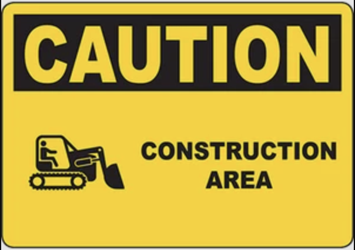

# Nonparametric Methods {#chap-nonparametrics}

This section is still under construction 

```{r, echo=FALSE, fig.cap = "Under construction sign", fig.alt="Picture of a traffic sign warning of a section of road being under construction.", out.width='50%', fig.align='left'}

```
