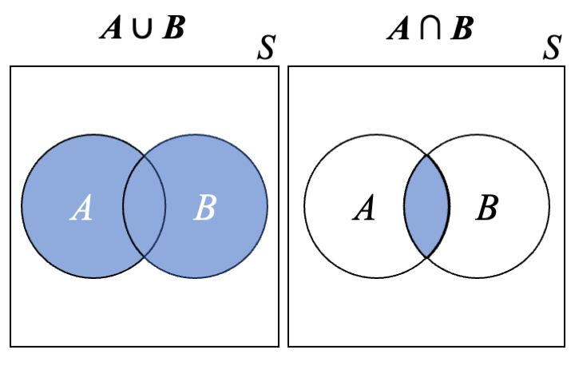
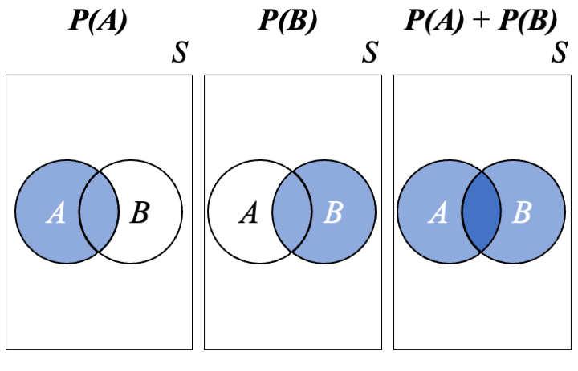
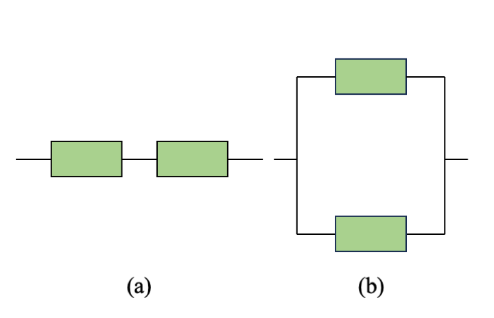
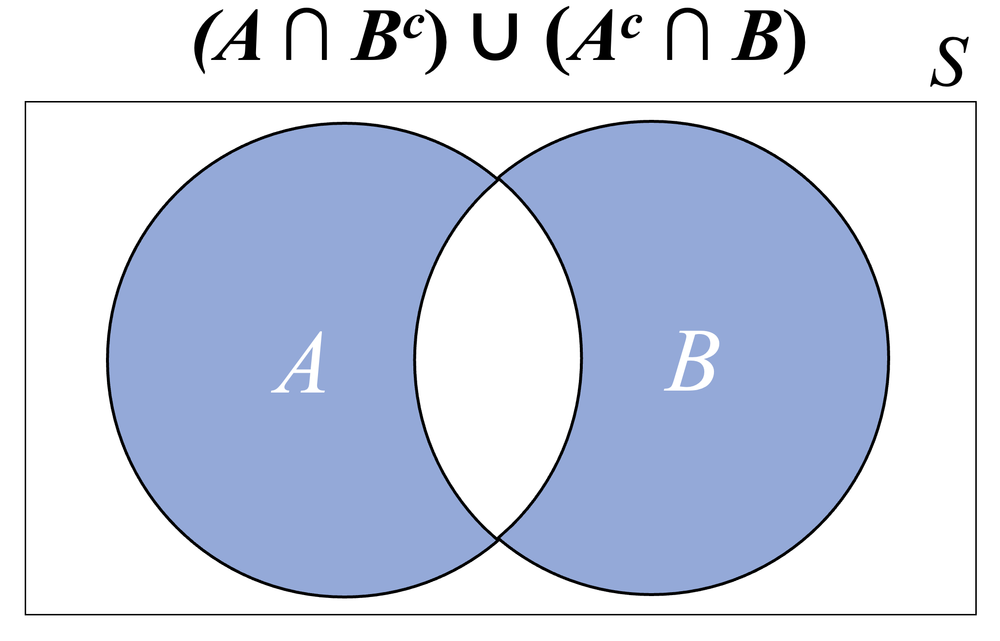
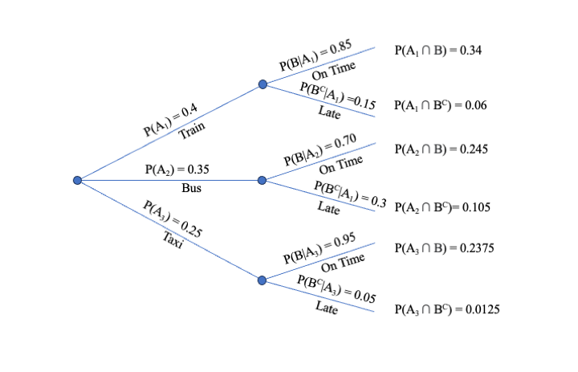
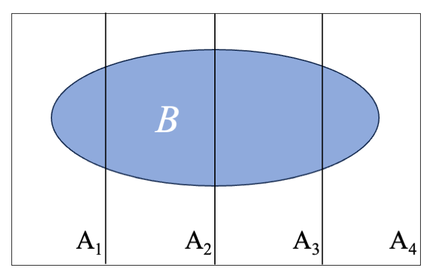
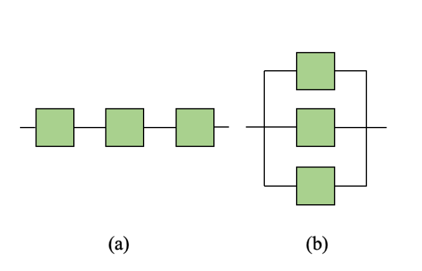

# [Probability]{#def-probability-probability} {#chap-probability}

Probability is a mathematical framework for working with random events. In this chapter, we will cover probability fundamentals.

## Motivation and Intuition

### Previewing Statistical Inference

In Statistics, our sample is subject to randomness. This means that any observations we make based on sample data are themselves subject to randomness, and there is unavoidable *uncertainty* associated with any lessons learned from sample data. We will use probability theory to enable confident statements about populations and parameters based on samples and sample statistics (this is called **statistical inference**; see, e.g., Chapters \@ref(chap-confidence-intervals) and \@ref(chap-hypothesis-testing)).

### Probability: A "Long-Run Average"

One intuitive way to think about a probability is as an average of the [outcomes]{#def-probability-outcomes} of repeating a [random experiment]{#def-probability-random-experiment} many times. For example, consider flipping a coin. With each flip, there are two possible outcomes: heads or tails. Intuitively, we understand that both outcomes are equally likely. Thus, without having yet formally defined the word probability, our estimate for the probability that a coin flip results in heads, would be $1/2$, or $0.5$ (which is correct). 

Suppose we flip a coin 10 times. Intuitively, we would *expect* about half of the flips to result in heads. However, since the result of each flip is governed by *randomness*, we cannot *guarantee* that exactly 5 out of our 10 flips will be heads. Just by chance, we might see 4 heads, or 6, or even 0 or 10. The further the actual count gets away from 5, the less likely it is to happen, but even highly unlikely events are still *possible* and, in fact, highly unlikely events *will* almost certainly happen if given enough chances.

A simple way to explore basic probability is with the `sample` function in `R`. For example, we can simulate a single coin flip with the command `sample(c(0, 1))`, letting the value 1 represent "heads"; `R` interprets this as "Choose one of the values 0 or 1, with each possible value having equal chance of being selected." In what follows, before randomly generating numbers, we run the command `set.seed` to ensure that the same random numbers are obtained each time our code is run; this way, if you follow along and run our code, you will get exactly the same results.
```{r}
## Set the random seed
set.seed(1010)

## Flip a coin one time. The 'size' argument tells R to sample just once.
sample(c(0, 1), size = 1)

## Flip a coin 10 times. The `replace = TRUE` argument tells R to sample from 
## both 0 and 1 each time.
sample(c(0, 1), size = 10, replace = TRUE)
```
When we flipped the coin 10 times, we got eight heads, just by chance. To illustrate the meaning of the statement "Probability(heads) = 0.5", we have to consider what happens in the *long run*, after flipping the coin many, many times. Here, we flip the coin one thousand times and compute a running proportion of heads along the way; for example, the proportion displayed after 100 flips equals the number of heads out of the first 100 flips divided by 100.
```{r}
S <- 1000
heads <- sample(c(0, 1), size = S, replace = TRUE)
p_running <- cumsum(heads) / (1:S)

plot(1:S, p_running, xlab = "Number of Flips", ylab = "Proportion", type = "b")
abline(0.5, 0, lty = 2, col = "grey")
```

Note that the `cumsum` function computes a cumulative sum of a vector of numbers and that we divided this by a vector of numbers in order to compute the "running" proportion. It is not critical that you understand the details of the code used here. We could have accomplished the same thing with easier to read code by using "brute force," such as a `for` loop. 

The takeaway message from the figure is that "Probability(heads) = 0.5" means that, in the *long run*, we can expect 50% of coin flips to result in heads. In the "short run," it is possible that the observed proportion will deviate substantially from the probability. For example, we saw 8 heads out of our 10 original flips, and the running proportion for the larger simulation was substantially below 0.5 for the first 100 flips or so. The more flips we do, however, the closer the running proportion comes to the probability, 0.5. If we were to continue the simulation infinitely, the running proportion would settle on 0.5 exactly.

## Sample Spaces and Events

We will start by defining the most atomic object in probability: a **random experiment** is a process that generates **outcomes**.  Note that it is best not to interpret the words `random` nor `experiment` individually, rather as an overall term for any process.   A simple example is a coin flip. The result of a coin flip will either be heads or tails, and it can not be known ahead of time which of these two outcomes will result. 

:::: {.colbox data-latex=""}
::: {.definition #def-sample-space}
The **[sample space]{#def-probability-sample-space}** $\mathcal{S}$ for an experiment is the set of all possible outcomes.
:::
::::

:::: {.whitebox data-latex=""}
::: {.example}
Flip a coin three times. 

(a) Write down the sample space in terms of instances of heads ($H$) and tails ($T$). 
(b) Suppose we will count the number of heads out of the three flips. Write down the sample space for this experiment.

_Solution_:

(a) $\mathcal{S} = \{HHH, HHT, HTH, HTT, THH, THT, TTH, TTT\}$
(b) $\mathcal{S} = \{0, 1, 2, 3\}$
:::
::::

An **[event]{#def-probability-event}** is a collection of outcomes, which is necessarily a [subset]{#def-probability-subset} of the sample space. Events are sets, so we will use set theory with them.  An event that consists of a single outcome is called **simple**, while an event that consists of multiple outcomes is called **compound**. Possible simple events after flipping a coin three times are $A = \{HTH\}$ (the first flip was heads, the second was tails, and the third was heads) and $B = \{2\}$ (there were two heads out of the three flips). A possible compound event is $C = \{2, 3\}$ (at least two heads). 

The **[union]{#def-probability-union}** of events $A$ and $B$ (denoted $A \cup B$) is the event that consists of outcomes that are in $A$, $B$ or both. Clues that the operation should be a union are words like 'or', 'at least', or 'either'. The **[intersection]{#def-probability-intersection}** of $A$ and $B$ (denoted $A \cap B$) is the event that consists of outcomes that are in both $A$ and $B$.   Clues that the operation should be an intersection are words like 'and' or 'both'. The **[complement]{#def-probability-complement}** $A^c$ of $A$ is the event that consists of all outcomes that are not in $A$. The events $A$ and $B$ are **disjoint** (alternatively called **mutually exclusive**) if they have no outcomes in common. Note that if $A$ and $B$ are disjoint, $A \cap B = \emptyset$, where $\emptyset$ is the empty set.  This means that the events $A$ and $B$ cannot both occur; either $A$ occurs, $B$ occurs, or neither occurs. Event $B$ is a **subset** of $A$ (denoted $B \subseteq A$) if all outcomes in $B$ are also in $A$. We can visualize union and intersection using a **Venn diagram** like those in Figure \@ref(fig:venn-1). 
```{r venn-1, out.width="80%", fig.align = 'center', fig.cap = "Venn diagrams showing union and intersection.", echo = FALSE}

```

:::: {.whitebox data-latex=""}
::: {.example}
A manufacturing company produces electronic components. Consider the inspection of a single component. Let $D$ be the event that the component is defective, and $N$ be the event that the component is not defective.

(a) What is the sample space? 
(b) What is $D \cup N$ and $(D \cup N)^c$?
(c) What is $D \cap N$ and $(D \cap N)^c$?

_Solution_:

(a) We can express the sample space $\mathcal{S}$ as either $\{\text{defective}, \text{not defective}\}$ or $\{D, N\}$.
(b) $D \cup N = \mathcal{S}$ and $(D \cup N)^c = \emptyset$.
(c) $D \cap N = \emptyset$ ($D$ and $N$ are disjoint) and $(D \cap N)^c = \mathcal{S}$.
:::
::::

:::: {.whitebox data-latex=""}
::: {.example}
In a chemical reaction, substances $A$ and $B$ are combined to create compound $C$. The reaction can be complete (all $A$ and $B$ are transformed into $C$) or partial, or there may be no reaction. Let $R_C$ be the event that corresponds to a complete reaction, $R_P$ be for a partial reaction, and $R_N$ be for no reaction. 

(a) What is the sample space?
(b) Describe in words and with set notation the event that a reaction is not complete.

_Solution:_

(a) $\mathcal{S} = \{R_C, R_P, R_N\}$.
(b) If a reaction is not complete, then there must either be a partial reaction or no reaction. In other words, $R_C^c = R_P \cup R_N$.
:::
::::

The following laws can be applied to collections of events:

* _Commutative_: $A \cup B = B \cup A$ and $A \cap B = B \cap A$.
* _Associative_: $(A \cup B) \cup C = A \cup (B \cup C)$ and $(A \cap B) \cap C = A \cap (B \cap C)$.
* _Distributive_: $(A \cup B) \cap C = (A \cap C) \cup (B \cap C)$ and $(A \cap B) \cup C = (A \cup C) \cap (B \cup C)$.
* _De Morgan_: $(A \cup B)^c = A^c \cap B^c$ and $(A \cap B)^c = A^c \cup B^c$.

:::: {.whitebox data-latex=""}
::: {.example}
Sarah is a college student. Let $E_1$, $E_2$, and $E_3$ be the events that Sarah owns headphones, a cellphone, and a laptop, respectively. 

(a) Apply the commutative laws to $E_1 \cup E_2$ and $E_1 \cap E_2$.
(b) Apply the associative law to $(E_1 \cup E_2) \cup E_3$. 
(c) Use the distributive law to explain the meaning of $(E_1 \cap E_2) \cup E_3$. 
(d) Use De Morgan's law to explain the meaning of $(E_2 \cup E_3)^c$.

_Solution:_

(a) Replacing events $E_k$, $k = 1, 2, 3$, with words, it is clear that the commutative laws are true. For example, "(Sarah owns headphones) and (Sarah owns a cellphone)" is clearly equivalent to "(Sarah owns a cellphone) and (Sarah owns headphones)."
(b) In words, $(E_1 \cup E_2) \cup E_3$ means "(Sarah owns headphones, a cellphone, or both) or (Sarah owns a laptop)," which is equivalent to "(Sarah owns headphones, a cellphone, a laptop, or any [combination]{#def-probability-combination} of these items)." According to the associative law, $(E_1 \cup E_2) \cup E_3 = E_1 \cup (E_2 \cup E_3)$, and $E_1 \cup (E_2 \cup E_3)$ means "(Sarah owns headphones) or (Sarah owns a cellphone, a laptop, or both)," which is again equivalent to "(Sarah owns headphones, a cellphone, a laptop, or any combination of these items)."
(c) In words, $(E_1 \cap E_2) \cup E_3$ means "(Sarah owns headphones and a cellphone) or (Sarah owns a laptop) or both events are true." According to the distributive law, $(E_1 \cap E_2) \cup E_3 = (E_1 \cup E_3) \cap (E_2 \cup E_3)$. The right-hand side means "(Sarah owns headphones, a laptop, or both) and (Sarah owns a cellphone, a laptop, or both)." 
(d) According to De Morgan's law, $(E_2 \cup E_3)^c = E_2^c \cap E_3^c$. That is, the complement of "(Sarah owns a cellphone) or (Sarah owns a laptop) or (Sarah owns both a cellphone and a laptop)" is "(Sarah does not own a cellphone) and (Sarah does not own a laptop)."
:::
::::

## Axioms and Properties

We now define probability and state general rules and properties.

:::: {.colbox data-latex=""}
::: {.definition}
Consider an experiment with sample space $\mathcal{S}$. Define $P(E)$ to be the **probability** that $E$ occurs. 
  
**Axiom 1**: $0 \le P(E) \le 1$  
**Axiom 2**: $P(\mathcal{S}) = 1$  
**Axiom 3**: For any sequence of [disjoint events]{#def-probability-disjoint-events} $E_1, E_2, \ldots, E_V$:
$$
P \left( E_1 \cup E_2 \cup \cdots \cup E_V \right) = \sum_{v=1}^{V} P(E_v)
$$
:::
::::
The first axiom states that a probability must be between 0 and 1, inclusive. The second axiom states that the probability the sample space will occur equals one; this is intuitive, since the sample space is defined as the collection of all possible outcomes. The third axiom states that for a collection of disjoint events, the probability of at least one occurring is the sum of the individual probabilities; note that Axiom 3 applies even in the case of a countably *infinite* sequence of disjoint events.

:::: {.colbox data-latex=""}
::: {.proposition}
The above axioms imply the following properties:

1. $P \left( A^c \right) = 1 - P(A)$.
2. If $A \subseteq B$ then $P(A) \leq P(B)$.
3. $P(\emptyset) = 0$.
:::
::::

::: {.proof}
To prove claim 1, note that we can write $\mathcal{S} = A \cup A^c$. Since $A$ and $A^c$ are disjoint, by Axiom 3 we can say that $1 = P(\mathcal{S}) = P(A) + P \left( A^c \right)$, so that $P \left( A^c \right) = 1 - P(A)$.
For claim 2, note that we can write $B = A \cup \left( B \cap A^c \right)$ and that $A$ and $B \cap A^c$ are disjoint. Then, 
$$
P(B) = P \left( A \cup \left( B \cap A^c \right) \right) = P(A) + P \left( B \cap A^c \right) \geq P(A)
$$
For claim 3, $\emptyset$ and $\mathcal{S}$ are disjoint and hence, by Axiom 3, $1 = P(\emptyset \cup \mathcal{S}) =  P(\emptyset) +  P(\mathcal{S})$.  By Axiom 2, then, $P(\emptyset) = 0$.
:::

:::: {.whitebox data-latex=""}
::: {.example}
Consider rolling a six-sided die. Define the events $A = \{2, 4, 6\}$ (roll an even number), $B = \{1, 3, 5\}$ (roll an odd number), and $C = \{2, 3, 4, 5, 6\}$ (roll a number greater than 1). We will see in Section \@ref(sec-probability-counting) how basic counting techniques can be used to compute the probabilities of these events. For now, we will just state that $P(A) = 1/2$, $P(B) = 1/2$, and $P(C) = 5/6$. 

Note that $A$ and $B$ are disjoint, $B = A^c$, and therefore $A \cup B = \{1, 2, 3, 4, 5, 6\} = \mathcal{S}$. Since the result of a die roll must be one of the numbers $1, 2, \ldots, 6$, $(A \cup B)^c = \emptyset$ and $P \left( (A \cup B)^c \right) = 0$. Note that $C^c = \{1\}$ and that $A$ and $C^c$ are disjoint, so that 
$$
P(A \cup C^c) = P(A) + P(C^c) = 1/2 + (1-5/6) = 2/3
$$
Because $A \subseteq C$, we know that $P(A) \leq P(C)$. 
:::
::::
:::: {.colbox data-latex=""}
::: {.proposition}
1. For any two events $A$ and $B$,
$$
P(A \cup B) = P(A) + P(B) - P(A \cap B)
$$
2. For any three events $A$, $B$, and $C$,
\begin{align*}
P(A \cup B \cup C) = &P(A) + P(B) + P(C) - P(A \cap B) - P(A \cap C) \\
&- P(B \cap C) + P(A \cap B \cap C)
\end{align*}
:::
::::

::: {.proof}
Reference Figure \@ref(fig:venn-2). You can visualize $P(A)$ by shading the circle labeled $A$ and $P(B)$ by shading the circle labeled $B$. Notice that, if you were to overlay those shaded regions (corresponding to adding $P(A)$ to $P(B)$), you would be double-shading the intersection. That is, simply adding $P(A)$ to $P(B)$ double-counts $P(A \cap B)$, which is why we must subtract one copy of the intersection probability. More formally, note that we can write $A \cup B$ as a union of two disjoint events ($A$ and $B \cap A^c$) and that $P(B \cap A^c) = P(B) - P(A \cap B)$. Thus
$$
P(A \cup B) = P(A) + P(B \cap A^c) = P(A) + P(B) - P(A \cap B)
$$
The claim regarding $P(A \cup B \cup C)$ can be similarly visualized with Venn diagrams and formally proved by defining an analogous collection of disjoint events.
:::
```{r venn-2, out.width="80%", fig.align = 'center', fig.cap = "Adding P(A) and P(B) 'double-counts' the intersection probability.", echo = FALSE}

```

:::: {.whitebox data-latex=""}
::: {.example}
The **reliability** of a system is the probability that the system works. Consider a system that is composed of two components. If the components are arranged as a series, then both components must work for the system to work (Figure \@ref(fig:reliability-1)(a)). In a parallel system, on the other hand, the system works if either component works (Figure \@ref(fig:reliability-1)(b)). Let $C_1$ and $C_2$ be the events that components 1 and 2 work, respectively, and suppose that $P(C_1) = 0.9$, $P(C_2) = 0.9$, and $P(C_1 \cap C_2) = 0.81$. Thus, the reliability of the series system is $0.81$. 

a. What is the reliability of the parallel system?
b. What is the probability that only one of the components works?

_Solution_: 

a. The reliability of the parallel system is
$$
P(C_1 \cup C_2) = P(C_1) + P(C_2) - P(C_1 \cap C_2) = 0.9 + 0.9 - 0.81 = 0.99
$$
b. The event that only one of the two components works can be written as $(C_1 \cap C_2^c) \cup (C_1^c \cap C_2).$ We can visualize this with a Venn diagram, as in Figure \@ref(fig:venn-3). Based on the figure, the probability equals
$$
P(C_1 \cup C_2) - P(C_1 \cap C_2) = 0.99 - 0.81 = 0.18
$$
:::
::::

```{r reliability-1, out.width="80%", fig.align = 'center', fig.cap = "(a) A two-component series system; (b) A two-component parallel system", echo = FALSE}

```
```{r venn-3, out.width="80%", fig.align = 'center', fig.cap = "Venn diagram corresponding to the event that only one of two components work", echo = FALSE}

```

## Counting {#sec-probability-counting}

There are many scenarios in which all possible outcomes of an experiment are equally likely. For example, when flipping a fair coin, we are equally likely to observe heads or tails. The situation is similar when rolling a six-sided die or drawing cards from a 52-card deck. In such scenarios, probabilities for arbitrary outcomes can be computed using *counting* techniques.

Consider an experiment with $N$ equally-likely outcomes, $E_1, E_2, \ldots, E_N$; for example, we can write $N = 2$, $E_1 = \{\text{heads}\}$, and $E_2 = \{\text{tails}\}$ for the coin toss experiment. Let $p = P(E_i)$ be the common probability of each event, and note that the $N$ probabilities must add up to 1. That is, $Np = 1$, and so $p = 1 / N$. Now consider an event $A$ that consists of $\#(A)$ of the $N$ possible outcomes; note that we are using the notation $\#(A)$ to mean the number of elements in the event $A$. Then
$$
P(A) = \frac{\#(A)}{N}
$$
Thus, when outcomes are equally likely, any probability can be computed by simply counting the number of ways the target event can occur and dividing by the total number of possible outcomes. 

:::: {.whitebox data-latex=""}
::: {.example}
Draw one card from a shuffled 52-card deck. What is the probability that your card is a "face card" (a jack, queen, or king)?

_Solution_: There are 12 face cards in a 52-card deck (there is a jack, queen, and king for each of the four suits). Defining the event $A = \{\text{jack}, \text{queen}, \text{or king}\}$, we have $\#(A) = 12$ and 
$$
P(A) = \frac{\#(A)}{N} = \frac{12}{52} = \frac{3}{13}
$$
:::
::::

### Product Rule

Consider a scenario in which events consist of ordered "tuples." A **k-tuple** is an ordered collection of $k$ numbers. For example, a 2-tuple is simply a pair of numbers, such as $(7, 3)$. Alternatively, we might roll a die five times and record the number of each roll, resulting in a 5-tuple, such as $(6, 2, 3, 1, 3)$. 

:::: {.colbox data-latex=""}
::: {.proposition}
Consider a task that results in a $k$-tuple. Suppose that there are $n_i$ possible choices for the $i$th element, regardless of the values of the preceding elements. Then the number of possible $k$-tuples equals the product $n_1n_2 \cdots n_k$. 
:::
::::

:::: {.whitebox data-latex=""}
::: {.example}
You are at a restaurant that offers three different appetizers and four different main courses. How many ways can you choose one appetizer and one main course for your meal?

_Solution:_ First, notice that we can characterize our meal with an ordered pair (a 2-tuple). For example, we could use one of the numbers $1, 2, 3$ in the first position to represent which of the three appetizers we select and one of the numbers $1, 2, 3, 4$ in the second position to represent which of the four main courses we select; thus, $(2, 1)$ would indicate that we selected the second appetizer and first main course. Since there are $n_1 = 3$ possible appetizer selections and $n_2 = 4$ possible main course selection, the total number of ways that we can choose our meal is $n_1 n_2 = 3 \cdot 4 = 12$.
:::
::::

:::: {.whitebox data-latex=""}
::: {.example}
You need to create a 5-character password using lowercase letters (a-z) and digits (0-9). How many passwords can you create?

_Solution:_ Here, our problem can be characterized as a 5-tuple. For each character in the password, there are 26 letters and 10 digits to choose from. Thus, we have $n_1 = n_2 = \cdots = n_5 = 36$, and the total number of possible passwords is $n_1n_2 \cdots n_5 = 36^5 =$ 60,466,176.
:::
::::

### Permutations and Combinations

Now consider the task of selecting $k$ individuals from a collection of $n$ individuals. Here, "individual" could generically refer to people, animals, objects, or any other distinct entity. The coach of a basketball team, for example, needs to choose 5 starters from his 15 active players before a game. Or, we might want to select 4 pizza toppings from a list of 12 available toppings. How many possible lineups are there for the basketball coach to choose from, and how many pizza possibilities are there?

An important distinction between the two examples just given is that outcomes in the basketball example are ordered, whereas outcomes in the pizza are example are unordered. That is, the ordering of the players selected to start the basketball game matters, because ordering corresponds to position played. For example, suppose the selected lineup is \{Maya, Zoe, Mia, Harper, Olivia\}, corresponding to the positions \{point guard, shooting guard, small forward, power forward, and center\}. Changing the ordering of the names in the lineup would mean changing position assignments. In the pizza example, on the other hand, the order in which the toppings are listed is irrelevant. Shuffling the list of toppings \{pepperoni, mushrooms, green bell peppers, and sausage\} does not change the pizza.

:::: {.colbox data-latex=""}
::: {.definition}
An ordered subset is called a **permutation**, and an unordered subset is called a **combination**. We will use $P_{k,n}$ to denote the number of permutations of size $k$ that can be formed from $n$ individuals. To denote the number of combinations of size $k$ that can be formed from $n$ individuals, we will use the notation $\binom{n}{k}$, read "$n$ choose $k$." 
:::
::::

We can apply the product rule to deduce formulas for counting permutations. For example, consider the task of selecting 5 starters from 15 active players on a basketball team. Following the ordering used in the example above, we will first select the point guard, then the shooting guard, and so on. Assuming for simplicity that all 15 players can play every position, we have 15 possibilities for point guard. Once the point guard has been selected, we have 14 players remaining from whom to choose the shooting guard, then 13 players from whom to choose the small forward, and so on. The total number of possible lineups is therefore $15 \cdot 14 \cdot 13 \cdot 12 \cdot 11$ = 360,360. 

We can formulate a general expression using *[factorial]{#def-probability-factorial}* notation. Recall that $m! = m(m-1)\cdots(2)(1)$, read "$m$ factorial." As a special case, note that $1!=1$, and we define $0! = 1$. With the basketball example, note also that we can write
$$
P_{5,15} = (15)(14)(13)(12)(11) = \frac{(15)(14)(13)(12)(11)(10!)}{(10!)} = \frac{15!}{10!}
$$
This enables us to write the following general expression.

:::: {.colbox data-latex=""}
::: {.proposition}
$$
P_{k,n} = \frac{n!}{(n-k)!}
$$
:::
::::

:::: {.whitebox data-latex=""}
::: {.example}
Consider forming letter combinations (which may or may not make sensible words) using the letters "H", "O", "U", "S", and "E."

a. How many letter combinations can we form using all 5 letters?
b. How many letter combinations can we form if we use just 3 letters?

_Solution_: We have $n = 5$ distinct letters to choose from.

a. $P_{5,5} = \frac{5!}{0!} = 5! = 120$
b. $P_{3,5} = \frac{5!}{2!} = 5(4)(3) = 60$
:::
::::

Now consider combinations, for which order does not matter. In the pizza example, consider the selection of toppings \{pepperoni, mushrooms, green bell peppers, and sausage\}. These four toppings can be ordered in $4! = 24$ ways. We know that there are $P_{4,12}$ = 12! / 8! = 11,880 *permutations* of four out of twelve toppings. To calculate the number of possible *combinations*, we need to correct for the fact that we do not care about order. We can accomplish this by dividing $P_{4,12}$ by $4!$: $\binom{12}{4} = P_{4,12} / 4! = 495$. 

:::: {.colbox data-latex=""}
::: {.proposition}
$$
\binom{n}{k} = \frac{P_{k,n}}{k!} = \frac{n!}{k!(n-k)!}
$$
:::
::::

:::: {.whitebox data-latex=""}
::: {.example}
It is movie night, and you want to select two movies to watch out of your library of six movies. How many way can you make this selection?

_Solution_: We want to choose $k = 2$ movies from a collection of $n = 6$ movies: 
$$
\binom{6}{2} = \frac{6!}{2!(6-2)!} = \frac{6(5)}{2} = 15
$$
:::
::::

:::: {.whitebox data-latex=""}
::: {.example}
In poker, each player is dealt five cards from a 52-card deck. A full house is a hand that consists of three cards of one rank and two cards of another rank; e.g., three nines and two queens is a full house. How many ways are there to be dealt a full house?

_Solution_: First, consider the selection of the rank for the three-of-a-kind. There are 13 total ranks (2, 3, $\ldots$, 10, jack, queen, king, ace), so there are $\binom{13}{1} = 13$ ways to choose the rank for the three-of-a-kind. There are now 12 remaining ranks to choose from for the two-of-a-kind (pair), so there are $\binom{12}{1} = 12$ ways to choose the rank for the pair. Given the rank for the three-of-a-kind (e.g., 9), there are $\binom{4}{3} = 4$ ways to choose the three suits. Similarly, there are $\binom{4}{2} = 6$ ways to choose the suits for the pair. The number of ways to be dealt a full house is then the product of these counts: $13(12)(4)(6)$ = 3,744. 
:::
::::

The relevant functions for doing these calculations in `R` are `factorial` and `choose`:
```{r}
factorial(6) / (factorial(2) * factorial(4))
choose(6, 2)
```


## [Conditional Probability]{#def-probability-conditional-probability}

Consider computing the probability of an event $A$ when we have information on another event $B$. The **conditional probability of $A$ given that $B$ has occurred** (denoted $P(A|B)$) will potentially be different from the **unconditional probability of $A$**. 

For example, early in the COVID-19 pandemic, there were diagnostic tests that could be conducted at home, but they were prone to errors (false positives for people without COVID-19 or false negatives for people with COVID-19). Consider a hypothetical early diagnostic test. If the test were given to a randomly-selected individual (selected without regard for whether they had symptoms), suppose that the probability of a positive result were 0.10 (10%); since the majority of people do not have COVID-19, most of the 10% positives would be false positives. However, if the test were given to an individual with COVID-19, suppose the probability of a positive result were 0.80 (80%). Thus, the probability of a positive test result would *depend on* whether an individual had COVID-19. The first probability (0.10) was an unconditional probability, while the second was a conditional probability.

:::: {.whitebox data-latex=""}
::: {.example}
Consider drawing a card from a 52-card deck, and define the events $A = \{ \text{red card} \}$ (hearts or diamonds) and $B = \{ \text{face card} \}$ (jack, queen, or king). Using our counting techniques, the unconditional probability of $A$ is
$$
P(A) = \frac{\#(A)}{N} = \frac{26}{52} = \frac{1}{2}
$$
Now consider how this probability would change if we knew that $B$ occurred (the card is a face card). There are 12 total face cards, of which 6 are red, so, intuitively, $P(A|B) = 6/12 = 1/2$. Note that what we just did was count the number of red face cards and divide by the number of face cards, allowing us to write
$$
P(A|B) = \frac{\#(A \cap B)}{\#(B)} = \frac{\#(A \cap B) / N}{\#(B) / N} = \frac{P(A \cap B)}{P(B)}
$$
:::
::::

:::: {.colbox data-latex=""}
::: {.definition}
For any two events $A$ and $B$ with $P(B) > 0$, the **conditional probability of $A$ given that $B$ has occurred** is
$$
P(A|B) = \frac{P(A \cap B)}{P(B)}
$$
:::
::::

Some clues that conditional probability should be used would be words like 'given', 'we know', 'it is known that', or other similar phrases conveying **information**.

:::: {.whitebox data-latex=""}
::: {.example #chap-probability-weather}
Consider today's weather. Let $A$ be the event that it rains and $B$ be the event that the weather forecaster predicts that it will rain. Suppose that $P(A) = 0.15$, $P(B) = 0.25$, and $P(A|B) = 0.80$ (that is, when a forecaster predicts rain it actually rains 80% of the time). What is the probability that it will rain and the forecaster will predict rain, $P(A \cap B)$?

_Solution_: $P(A \cap B) = P(A|B) \cdot P(B) = 0.80 \cdot 0.25 = 0.20$.

Notice the use of 'given' and 'and' in the problem statement.  These are important words for determining if we should conditional probability or an intersection.
:::
::::

:::: {.whitebox data-latex=""}
::: {.example #transportation}
A transportation company offers three services: train, bus, and taxi. Among its customers, 40% choose to travel by train, 35% choose bus, and 25% choose taxi. Among those who take the train, 85% arrive to their destination on time, and the corresponding numbers for bus and taxi are 70% and 95%, respectively. 

a. What is the probability that a randomly-selected customer travels by train and arrives on time?
b. What is the probability that a randomly-selected customer arrives on time?
c. Given that a customer arrived to their destination on time, what is the probability that they took a taxi?

_Solution_: Let $A_1 = \{\text{travel by train}\}$, $A_2 = \{\text{travel by bus}\}$, $A_3 = \{\text{travel by taxi}\}$, and $B = \{\text{arrive on time}\}$. We know the following: $P(A_1) = 0.40$, $P(A_2) = 0.35$, $P(A_3) = 0.25$, $P(B|A_1) = 0.85$, $P(B|A_2) = 0.70$, and $P(B|A_3) = 0.95$. 

a. Notice that this is *not* asking for a conditional probability. Rather, the question is about an "and" or "joint" probability: $P(A_1 \cap B) = P(B|A_1) \cdot P(A_1) = 0.34$. 
b. This question is asking for $P(B)$, the "individual" (as opposed to "conditional") probability that a customer arrives on time, without respect for mode of transportation. We can answer this by noting that $B = (A_1 \cap B) \cup (A_2 \cap B) \cup (A_3 \cap B)$. That is, a customer who arrives on time must either arrive on time by train, arrive on time by bus, or arrive on time by taxi. The three event intersections are disjoint, so we can add their probabilities:
$$
P(B) = P(A_1 \cap B) + P(A_2 \cap B) + P(A_3 \cap B) = 0.34 + 0.245 + 0.2375 = 0.8225.
$$
c. This question is asking for $P(A_3|B)$, requiring us to switch the ordering of conditioning relative to the information we were provided. We can solve this by simply applying the definition of a conditional probability:
$$
P(A_3|B) = \frac{P(A_3 \cap B)}{P(B)} = \frac{0.2375}{0.8225} = 0.2887538
$$
We also have shown a **tree diagram** for this example. The initial branches correspond to mode of transportation. There are then two second-generation branches emanating from the first three branches, corresponding to whether a customer arrives on time or does not. To the right of each branch corresponding to on-time arrival, we display the product of the probabilities for each involved branch. Tree diagrams can be useful for visualizing probabilities involving multiple events and conditioning. 
:::
::::

```{r tree-1, out.width="90%", fig.align = 'center', fig.cap = "Tree diagram for the transportation example", echo = FALSE}

```

We referred to the probability we computed in Example \@ref(exm:transportation)(b) as an "individual" probability, in the sense that no conditioning was involved. That probability can also be referred to as a "total" probability, in the sense that it involved summing up all possible joint (intersection) probabilities. More generally, let $A_1, A_2, \ldots, A_V$ be a **[partition]{#def-probability-partition}** of the sample space; that is, the $A_v$ are disjoint and $A_1 \cup A_2 \cup \cdots \cup A_V = \mathcal{S}$. In Example \@ref(exm:transportation), $A_1$, $A_2$, and $A_3$ constituted a partition. Each customer must choose just one mode of transportation (for a given trip), and the only modes to choose from are train, bus, and taxi. The **[Law of Total Probability]{#def-probability-law-of-total-probability-lotp}** states that the probability of an event $B$ can be expressed as the sum of all the probabilities $B$ and $A_v$, that is, $P(B \cap A_v)$, which we will further rewrite using conditional probability as $P(B | A_v)P(A_v)$:  

:::: {.colbox data-latex=""}
::: {.law}
**Law of Total Probability** Let $A_1, A_2, \ldots, A_V$ be a partition of $\mathcal{S}$. For any event $B$,
$$
P(B) = P(A_1)P(B|A_1) + \cdots + P(A_V)P(B|A_V)
$$
:::
::::

::: {.proof}
Because the $A_v$ constitute a partition, every possible outcome must fall into exactly one of the $A_v$. We can therefore partition $B$ into components defined by intersections with the $A_v$; that is,
$$
P(B) = P(A_1 \cap B) + \cdots + P(A_V \cap B)
$$
You can visualize this partitioning of $B$ as in Figure \@ref(fig:lawtotprob). The proof can be completed by replacing the summands with products of conditional and unconditional probabilities; i.e., $P(A_v \cap B) = P(A_v)P(B|A_v)$, $v = 1, 2, \ldots, V$.
:::

```{r lawtotprob, out.width="80%", fig.align = 'center', fig.cap = "Partitioning of an event $B$", echo = FALSE}

```

In the same context, **[Bayes' Theorem]{#def-probability-bayes-theorem}** utilizes the Law of Total Probability to provide an important result that allows us to switch the ordering of conditional probabilities. That is, suppose we know $P(A_v)$ and $P(B|A_v)$, $v = 1, 2, \ldots, V$, and wish to compute a probability for one of the $A_v$ conditional on $B$, $P(A_v|B)$. Bayes' Theorem shows us how.

:::: {.colbox data-latex=""}
::: {.law}
**Bayes' Theorem** Let $A_1, A_2, \ldots, A_V$ be a partition of $\mathcal{S}$. For any event $B$ for which $P(B) > 0$,
$$
P(A_w|B) = \frac{P(A_w)P(B|A_w)}{\sum_{v=1}^V P(A_v)P(B|A_v)}
$$
:::
::::

::: {.proof}
To prove Bayes' Theorem, first note that the denominator equals $P(B)$ (an application of the Law of Total Probability), then apply the definition of conditional probability to rewrite $P(B|A_w)$ as $P(A_w \cap B) / P(A_w)$. 
:::

:::: {.whitebox data-latex=""}
::: {.example}
Recall that in Example \@ref(exm:transportation)(c), we computed $P(A_3|B) = 0.2887538$, the probability that a customer took a taxi given that they arrived at their destination on time. We can use Bayes' Theorem to verify the result:
\begin{align*}
P(A_3|B) &= \frac{P(A_3)P(B|A_3)}{P(A_1)P(B|A_1) + P(A_2)P(B|A_2) + P(A_3)P(B|A_3)} \\
&= \frac{0.25 \cdot 0.95}{0.40 \cdot 0.85 + 0.35 \cdot 0.70 + 0.25 \cdot 0.95} = 0.2887538
\end{align*}
:::
::::

:::: {.whitebox data-latex=""}
::: {.example}
We began this section with the example of a COVID-19 diagnostic test. The hypothetical test we considered was not particularly accurate, whereas the actual tests are more accurate. Let $D = \{\text{subject has COVID-19}\}$ and $T = \{\text{test is positive}\}$. We hypothesized that $P(T) = 0.10$ and $P(T|D) = 0.80$. The first probability refers to the administration of the test to randomly-selected individuals, without consideration for whether they are sick or not. Even when its prevalence was highest, the majority of the general population did not have COVID-19, so most of the 10% positives would be false positives. The second probability is called the **sensitivity** of the diagnostic test, or the probability of a positive test given that the individual has the disease. A related metric that is commonly used to characterized a diagnostic test is called **specificity**, or the probability of a negative test given that the individual does not have the disease; in our context, we would write specificity as $P(T^c|D^c)$. Suppose that for our hypothetical COVID-19 test, $P(T^c|D^c) = 0.90$. 

In addition to sensitivity and specificity as measures of the efficacy of a diagnostic test, we might wish to calculate $P(D|T)$ and $P(D^c|T^c)$. The first quantity, also called the **positive predictive value**, is the probability that an individual has COVID-19 given a positive test. The second quantity, called the **negative predictive value**, is the probability that an individual does not have COVID-19 given a negative test. In order to apply Bayes' Theorem, we require $P(D)$, the prevalence of COVID-19 in the general population. Let us assume for illustration purposes that $P(D) = 0.08$. 

Compute $P(D|T)$ and $P(D^c|T^c)$ for our hypothetical diagnostic test.

_Solution_:  The positive predictive value is
\begin{align*}
P(D|T) &= \frac{P(D)P(T|D)}{P(D)P(T|D) + P(D^c)P(T|D^c)} \\
&= \frac{0.08 \cdot 0.80}{0.08 \cdot 0.80 + (1 - 0.08) \cdot (1 - 0.90)} = 0.4102564
\end{align*}
Similarly, the negative predictive value is
\begin{align*}
P(D^c|T^c) &= \frac{P(D^c)P(T^c|D^c)}{P(D)P(T^c|D) + P(D^c)P(T^c|D^c)} \\
&= \frac{(1 - 0.08) \cdot 0.90}{0.08 \cdot (1 - 0.80) + (1 - 0.08) \cdot 0.90} = 0.9810427
\end{align*}
:::
::::

## Independence

At the beginning of this section, we stated that $P(A|B)$, the conditional probability of $A$ given $B$, *potentially* differs from the unconditional probability $P(A)$. It is certainly not always the case that knowledge of one event having occurred will affect the probability of another event occurring.

:::: {.colbox data-latex=""}
::: {.definition}
The events $A$ and $B$ are **[independent]{#def-probability-independent}** if $P(A \cap B) = P(A)P(B)$.
The events $A$ and $B$ are **[dependent]{#def-probability-dependent}** if $P(A \cap B) \ne P(A)P(B)$.
:::
::::

Note that an implication of independence is
$$
P(A | B) = P(A)
$$
Note also that independence means *both* that $P(A|B) = P(A)$ *and* $P(B|A) = P(B)$; to see the second result, we can use the definition of independence and write
$$
P(B|A) = \frac{P(A \cap B)}{P(A)} = \frac{P(A|B)P(B)}{P(A)} = \frac{P(A)P(B)}{P(A)} = P(B)
$$

:::: {.whitebox data-latex=""}
::: {.example}
In the COVID-19 diagnostic test example, the events $D = \{\text{subject has COVID-19}\}$ and $T = \{\text{test is positive}\}$ are dependent. In particular, the probability of a positive test depends (as one would hope) on whether an individual has COVID-19: $P(T|D) = 0.80 \neq 0.10 = P(T)$.
:::
::::

:::: {.whitebox data-latex=""}
::: {.example}
Draw one card from a 52-card deck, and let $A$ be the event that the card is a heart. Draw a second card, and let $B$ be the event that the second card is a face card. Answer whether $A$ and $B$ are independent under the following two scenarios.

a. You *replace the first card* before drawing the second card.
b. You *do not replace the first card* before drawing the second card.

_Solution_:

a. By replacing the first card before drawing the second card, the same exact 52-card deck is used for each draw. The outcome of the first draw has no impact on the probabilities governing the second draw, making $A$ and $B$ independent. In particular, $P(B|A) = P(B) = \frac{3}{13}$.
b. If the first card is not returned to the deck before the second card is drawn, the composition of the deck is different for the second draw than it was for the first. There are only 51 cards to draw from the second time. Also, the number of available face cards to draw from depends on whether the first draw was a face card. As a result, $A$ and $B$ are dependent, and $P(B|A) \neq P(B)$. 
:::
::::

:::: {.colbox data-latex=""}
::: {.proposition}
1. If $A$ and $B$ are independent, then so are $A^c$ and $B$, $A$ and $B^c$, and $A^c$ and $B^c$.
2. The empty set, $\emptyset$, and the sample space, $\mathcal{S}$, are independent from any other set.
3. If $A$ and $B$ are disjoint, they are not independent unless $P(A) = 0$ or $P(B) = 0$.
:::
::::

::: {.proof}
1. Note that we can write $B = (A \cap B) \cup (A^c \cap B)$ so that 
$$
P(B) = P(A \cap B) + P(A^c \cap B) = P(A)P(B) + P(A^c \cap B)
$$
where the second equality is an application of the fact that $A$ and $B$ are independent. Rearranging, we have $P(A^c \cap B) = P(B)(1-P(A)) = P(A^c)P(B)$, proving that $A^c$ and $B$ are independent. Proofs for the other two pairs of events are similar.
2. For any event $A$, $A \cap \emptyset = \emptyset$, so $0 = P(A \cap \emptyset) = P(\emptyset)P(A) = 0$; hence, $A$ and $\emptyset$ are independent. Similarly, since $\mathcal{S} = \emptyset^c$, part 1 of this proposition proves that $A$ and $\mathcal{S}$ are independent.
3. Assume without loss of generality that $P(A) > 0$. Since $A$ and $B$ are disjoint, if $B$ occurs, then $A$ cannot possibly occur, so $P(A|B) = 0 \neq P(A)$. 
:::

:::: {.whitebox data-latex=""}
::: {.example}
Roll a die twice. Let $A$ be the event that the result of the first roll is even and $B$ be the event that the result of the second roll is greater than 4. We have $P(A) = 1/2$ and $P(B) = 1/3$. Use $P(A)$ and $P(B)$ to compute $P(A^c \cap B^c)$, or the probability that the first roll is odd and the second roll is less than or equal to 4. 

_Solution_: Since $A$ and $B$ are independent, $A^c$ and $B^c$ are also independent, so that $P(A^c \cap B^c) = P(A^c)P(B^c) = (1/2)(4/6) = 1/3$.
:::
::::

The concept of independence extends to more than two events. We say that a collection of events are *mutually* independent if the joint probability of any subset of the events equals the product of the corresponding individual probabilities.

:::: {.colbox data-latex=""}
::: {.definition}
The events $E_1, E_2, \ldots, E_V$ are **[mutually independent]{#def-probability-mutually-independent}** if for every subset $E_{w_1}, E_{w_2}, \ldots, E_{w_v}$, $v \leq V$,
$$
P(E_{w_1} \cap E_{w_2} \cap \cdots \cap E_{w_v}) = P(E_{w_1})P(E_{w_2}) \cdots P(E_{w_v})
$$
:::
::::

:::: {.whitebox data-latex=""}
::: {.example}
Figure \@ref(fig:reliability-2) shows three-component systems arranged in (a) series and (b) parallel. Let $C_i$ be the event that component $i$ works, $i = 1, 2, 3$. Let $R_s$ and $R_p$ be the reliability of the series and parallel systems, respectively. Suppose the reliabilities of the three components are $P(C_1) = 0.85$, $P(C_2) = 0.75$, and $P(C_3) = 0.80$, and assume that the components are mutually independent. Compute the reliability of the (a) series and (b) parallel systems.

_Solution_:

a. The series system works if all three components work. Thus, its reliability is the probability of an intersection, equal to the product of the component reliabilities: 
$$
R_s = P(C_1 \cap C_2 \cap C_3) = P(C_1) \cdot P(C_2) \cdot P(C_3) = 0.85 \cdot 0.75 \cdot 0.80 = 0.51
$$
b. The parallel system works if at least one of the three components works. Its reliability is the probability of a union:
\begin{align*}
R_p &= P(C_1 \cup C_2 \cup C_3) \\
&= P(C_1) + P(C_2) + P(C_3) - P(C_1 \cap C_2) - P(C_1 \cap C_3) - P(C_2 \cap C_3) \\
& \hspace{1cm} + P(C_1 \cap C_2 \cap C_3) \\
&= 0.85 + 0.75 + 0.80 - 0.85 \cdot 0.75 - 0.85 \cdot 0.80 - 0.75 \cdot 0.80 + 0.85 \cdot 0.75 \cdot 0.80 \\
&= 0.9925
\end{align*}
Note that for the parallel system to fail, all three components must fail. Thus, another (equivalent) way to compute $R_p$ is
$$
R_p = 1 - P(C_1^c \cap C_2^c \cap C_3^c) = 1 - (1 - P(C_1)) \cdot (1 - P(C_2)) \cdot (1 - P(C_3)).
$$
:::
::::

```{r reliability-2, out.width="80%", fig.align = 'center', fig.cap = "Three-component systems: (a) series and (b) parallel.", echo = FALSE}

```


