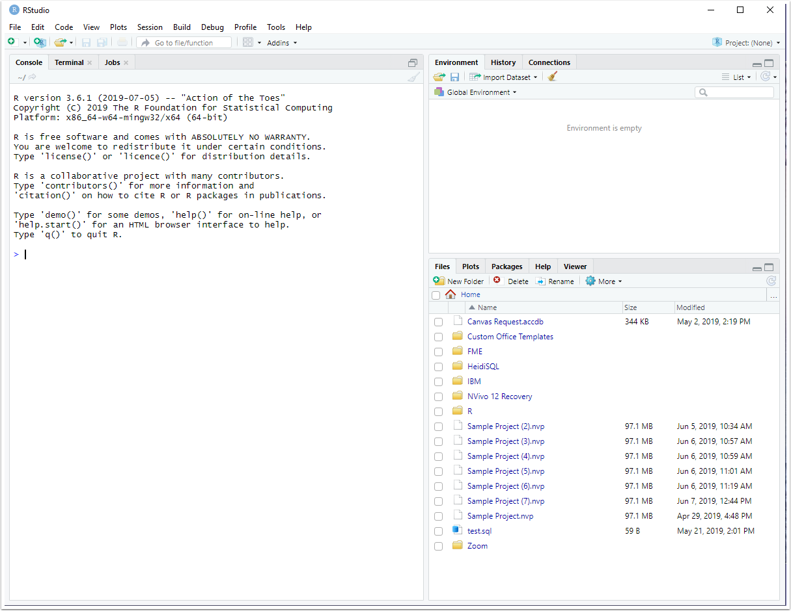

# Appendix: R Tutorial {#chap-r-tutorial}
This serves as a gentle introduction to R, a statistical programming language. R is used throughout this textbook and is one of the most popular programming languages throughout the world, with applications in research, data science, biostatistics, and business, just to name a few. 

## Downloading and Installing R and RStudio 
Before diving into R, you must first install R and RStudio onto your device. R is the programming language, and RStudio is the IDE (Integrated Development Environment) that makes makes it easy to code in R, see your results, and ask for help. 

To install R, follow these steps: 

1. Go to https://cran.r-project.org/ 
2. Under the "Download and Install R" heading, there are links to download R for various operating systems. Click the link that matches your operating system (Windows, Linux, or Mac)


3. After clicking the link, a new window will appear. On the first line, click the "install R for the first time" link.


4. A new window will appear, click on the "Download R" link (the first link at the top of the page). This link will be specific to the current version of R for your computer's operating system.


5. Open the downloaded file. 
6. Select your preferred language, then follow the Instillation Wizard prompts.
7. Click Finish, R is now installed on your computer. 

To install R Studio, follow these steps:

1. Go to [https://posit.co/](https://posit.co/) 
2. Click on "Download R Studio" in the top right-hand corner


3. A new window will appear. Scroll down until you find the RStudio Desktop heading. Then click "Download RStudio"


4. A new window will appear with the option to download R or RStudio. Click on the option to download RStudio. 


5. A file will download. Click on the file, and the RStudio Installation Wizard will appear. 
6. Complete the Installation Wizard's prompts. 
7. RStudio is now installed on your computer.When you open RStudio, a window similar to the one below should appear. 




## The Layout of RStudio 
The following image is an example of what RStudio might look like when performing statistical analysis. RStudio has 4 panes, and knowledge of these panes will allow you to take advantage of all that RStudio has to offer. 


### The Source Pane
The source pane allows users to edit and view a variety of different code files, including .R, .rmd, .qmd, .py, .css, or .txt. Once you create, edit, and test one of these files, you can then save the file for future work. 


### The Console Pane
The console pane allows users to interactively execute code. By default, the code is read and executed in the R programming language. Coding in the console is best for quick analysis or calculations, but any detailed analysis should be coded in the source panel as it allows the code to be saved.


### The Environments Pane
The environments pane contains a number of different tabs.

The "Environment" tab displays currently saved R objects.
  
The "History" tab displays R commands that were executed in   the current coding session, along with a search bar for you   to find previous commands. 
  
The "Connections" tab shows connections to local or remote    databases. 
   
The "Tutorial" tab contains helpful tutorials on how to use   R and its many functions. 


### The Output Pane 
The output pane displays the various outputs of your R programs. Its tabs include Files, Plots, Packages, Help, and Presentation. 

The "Files" tab allows you to explore files within the current working directory of your R program. 

The "Plots" tab displays the images created by R code in the current session. 

The "Packages" tab displays the R packages that are installed on your computer, and allows you to search for new packages. 

The "Help" tab allows you to search through R documentation. 

The "Viewer" tab displays web content and and interactive visualizations. 

The "Presentation" tab displays HTML slides. 


## R Basics
Now that we have R and RStudio downloaded, and are familiar with the RStudio layout, we can begin learning the basics of R. 

### Creating a .R file
To begin coding in R, we must first create an R file. In RStudio, complete the following steps: 

1. Click on the "File" tab at the top-left corner
2. Hover over "New File"
3. Click on R Script 

A new, untitled R script will now appear in your source pane.

### Saving your .R file
To save your .R file, complete the following steps: 

1. Hover over the "Save current" icon at the top of the source pane, or press CTRL+S 


2. Navigate to the directory where you want to save your document. This directory will become your **current working directory**. R will set this as the default location for any files you read into R or any .R files that you save. 
  + You can always check your current working directory by        typing **getwd()** in the console pane and pressing Enter.
  
  
  
  + You can change your working directory at any time by         completing these steps: 
  
    1. Click on the "Session" tab at the top of RStudio
    2. Hover over "Set Working Directory"
    3. Click "Choose Directory"
    4. Then navigate to and choose your new current working          directory.
    
    

3. Name your document, and press save. 

### Importing Data into R for Analysis
R allows for external datasets to be imported, or read, into the R environment for analysis. 

#### Importing a .csv file
The **read.csv** function is used to import .csv files into R. The function has three main arguments: 

1. **file**, which is used to specify the file path and file name. The file should be located in your working directory. 
2. **header**, which is used to indicate whether the first row of the dataset consists of variable names or data. By default, header is set to **TRUE**. 
3. **sep**, which is used to specify the characters that separate data values in the dataset. **,** is the default separator value. 
```{r}
#Check that working directory is the same directory where your dataset is stored. 
getwd()

#Read in csv file
#iris <- read.csv("tutorial_images\\iris.csv", header=TRUE)

#View first five rows of iris dataset
#head(iris, 5)
```

#### Importing a .txt file
The **read.table()** function is used to import files in table format. The function's arguments are identical to the **read.csv** function shown above, but with different default arguments: 

1. **file**, which is used to specify the file path and file name. The file should be located in your working directory. 
2. **header**, which is used to indicate whether the first row of the dataset consists of variable names or data. By default, header is set to **FALSE**. 
3. **sep**, which is used to specify the characters that separate data values in the dataset. **"" ""**, or a single white space, is the default separator value.
```{r}
#Check that working directory is the same directory where your dataset is stored. 
getwd()

#Read in txt file, 
#data <- read.table("tutorial_images\\data.txt", header=TRUE, sep=" ")

#View first five rows of table dataset
#head(data, 5)
```


### Coding in RStudio
You can type your code into the source pane. Whenever you want to save your code, press the save button or perform Ctrl+S. The source pane will execute your code when you press the "Run" button at the top of the pane. The code is interpreted and executed using R, with the output displayed in the console. 


### Comments
In the picture above, the line of code "5 + 5" was executed in R. Above that line is a comment, started using the pound, or hashtag, symbol (#). Comments are important in R programming, and are used to describe when the lines in your program do. Any text after a # symbol will not be executed in the code. R will skip over the comment and run the next available line of code. 

### Arithmetic in R
Some of the most simple operations that R can perform include basic arithmetic. 

These are some of the most prevalent arithmetic operators: 

1. Addition: + 
```{r}
5 + 5
```

2. Subtraction: - 
```{r}
2 - 1
```

3. Multiplication: * 
```{r}
2 * 5
```

4. Division: / 
```{r}
10 / 3 
```

5. Modulus: %%
```{r}
# The modulus operator returns the remainder of division between two numbers. 

#The remainder after division between 10 and 3 is 1. 

10 %% 3
```

6. Exponentiation 
```{r}
#The exponentiation operator raises the number on the left side of the operator to the power of the number on the right side of the operator. 

5 ^ 2
```

### Variables and Variable Assignment
A variable is a name given to a memory location on your computer that can be used to store data. 

To assign a value to a variable, use the <- sign. 

Variables are created when you assign values to them. 

To print a variable's value, type the name of the variable. 
```{r}
#Assign 5 to the variable x
x <- 5 

#Print the value of x
x
```

Arithmetic operators can be applied to variables. The operators act on the values stored in the variables. 

```{r}
#Assign 5 to the variable x
x <- 5 

#Assign 10 to the variable y
y<- 10

#Print the value of x
x

#Print the value of y 
y

#Add x and y
x + y
```

### Data Types in R
In the above example, addition was performed between two numeric variables. What if addition was performed between one numeric variable and a variable of a different type?
```{r, error=TRUE}
#Assign 5 to the variable x
x <- 5 

#Assign 10 to the variable y
y<- "ten"

#Print the value of x
x

#Print the value of y 
y

#Add x and y
x + y
```

The addition between x and y results in an error because addition can only be performed between two numeric variables. In this case, x is a numeric variable and y is a string variable. 

Here is a list of the basic data types frequently used in R:

1. **Numerics**: Decimal values like 3.14, 10, and 55.7
2. **Integers**: Whole number values, like 5, 10, 1000 Integer values can also be numeric values. That is, 10 can be a numeric or integer type. To ensure that a value is stored as an integer, place an L after the number. 
3. **Complex**: Complex numbers, like 10+3i, where i is imaginary
4. **Characters**: Text or string values, like "statistics"
5. **Logical**: Otherwise known as boolean values. Either TRUE or FALSE

To check a variable's data type, use the class() function. 
```{r}
#Define variables
x <- 10.3
y <- 20L
z <- 3+5i
l <- "statistics"
m <- TRUE

#Check variable data types
class(x)
class(y)
class(z)
class(l)
class(m)

```

### Vectors
R makes use of various data structures to store data. The most basic of these structures is the **vector**. 

Vectors are one dimensional arrays (tables) that can hold items that are of the same type. In other words, vectors are simply a list of numeric, character, or logical data. 

#### Creating Vectors
The combine function, **c()**, is used to create vectors. Place the values of the vector, separated by commas, within the function's parentheses. 
```{r}
#Numeric vector 
numbers <- c(55.2, 3, 10000)

#Character vector
fruits <- c("bananas", "grapes", "apples", "oranges")

#Logical vector
correct <- c(FALSE, TRUE, TRUE, FALSE)

#Print the vectors
numbers
fruits
correct
```

Use the **:** operator to create a vector of a sequence of values.
```{r}
#Want a vector the values from 10 to 20 (inclusive)
x <- 10:20

#Print the value of x
x
```

Use the **seq()** function to create vector of a sequence of values with a custom interval. 
```{r}
#Create a sequence of values from 10 to 100 with an interval of 15. 
x <- seq(10, 100, by=15)

#Print x
x
```

#### Naming Elements of A Vector
Use the **names()** function to give names to the elements of a vector. The name of each element will be printed above its value. 
```{r}
#Create a vector of student grades
grades <- c('A', 'A', 'C', 'D')

#Name the elements in the vector
names(grades) <- c('Brian', 'Sophia', 'Zachary', 'Anne')

#Print the vector
grades

```

#### Vector Length
Use the **length()** function to display the number of elements in a vector.
```{r}
#Create a vector of numeric values
x <- 1:5

#Print the number of elements in the vector
length(x)
```

#### Sort a Vector
Use the **sort()** function to sort a vector alphabetically or numerically. 
```{r}
#Create a vector of strings
s <- c("football", "basketball", "baseball", "hockey")
#Create a vector of numeric values
n <- c(5, 2, 3, 4, 10, 1)

#Sort s in alphabetical order
sort(s)
#Sort n from smallest to largest values
sort(n)
#Sort n from largest to smallest values
sort(n, decreasing = TRUE)
```

#### Repeat a Vector
Use the **rep()** function to repeat each element of a vector, or repeat an entire vector, a specified number of times.
```{r}
#Vector creation
fruits <- c("bananas", "grapes", "oranges")

#Repeat each element of the vector 3 times
rep(fruits, each=3)

#Repeat the entire vector three times
rep(fruits, times=3)
```

#### Vector Arithmetic

When performing arithmetic between two vectors, the arithmetic is done in an element-wise fashion. That is, the first element of the first vector is added/subtracted/divided/multiplied to/by the first element of the second vector, then the second element of the first vector is added/subtracted/divided/multiplied to/by the second element of the second vector, etc. 
```{r}
#Vector creation
a <- c(1, 2, 3, 4)
b <- 4:7

#Print the vectors
a
b

#Perform element-wise addition on the vectors
a+b 

#Perform element-wise subtraction on the vectors
a-b
```

If you want to add all of the elements in a single vector together, use the **sum()** function
```{r}
#Vector creation
a <- c(1, 2, 3, 4)

#Print the vector
a

#Add the elements of the vector together
sum(a) 
```

#### Subsetting a Vector
Subsetting is the process of selecting certain elements of a data structure. Double brackets (**[]**) are used to select certain elements of a vector. To select a certain element, type the index of the element between the double brackets. 

**R starts it's index at 1, not 0. If you want to select the first element of a vector, you must place a 1 within the square brackets**

```{r}
#Vector creation
fruits <- c("bananas", "grapes", "oranges")

#Select the first element of the fruits vector
fruits[1]

#Select the last element of the fruits vector
fruits[3]

#For long vectors, use the length() function to select the last element of the vector
fruits[length(fruits)]

```

You can select multiple elements of a vector by putting a vector of the positions you want to subset between the square brackets. 
```{r}
#Vector creation
states <- c("Texas", "Oklahoma", "Virginia", "Maryland", "Florida")

#Select the first and third elements of the states vector
states[c(1,3)]

#Select the third and last elements of the states vector
states[c(3,5)]

#Select the second through the last elements of the states vector
states[2:length(states)]

```

### Logical Operators in R
The logical (comparison) operators in R are: 

1. **<**: Less than
2. **>**: Greater than
3. **<=**: Less than or equal to
4. **>=**: Greater than or equal to
5. **==**: Equal to
6. **!=**: Not equal to

Logical operators return boolean (TRUE or FALSE) values. 

You can combine logical operators using **&** (and), **|** (or), and **!** (not). 
```{r}
x <- 10
y <- 25
z <- 45.10

#Check that x is a numeric data type
is.numeric(x)

#Check that x is greater than 2
x>2 

#Check that x is greater than 2 and y is less than 15
x>10 & y<15

#The not operator returns the opposite of the logical value it is used on. 
!x>5 


```

Some other helpful logical operators are: 
* **any()** (TRUE if any element meets the condition)
* **all()** (TRUE if all elements meet the condition)
* **%in%** (TRUE if an element is in the vector being searched)
```{r}
#Create a vector
color <- c("red", "orange", "green", "yellow")

#Check to see if any of the elements in color are "green"
any(color=="green")

#Check to see if all of the elements in color are "green"
all(color=="green")

#Check to see if "orange" is in the color vector
"orange" %in% color 

```

#### NAs and is.na()
is.na() is another logical operator that deserves special attention. NA stands for **not available** and means that a data value is missing. You can use is.na() to check whether a data value is missing. 

**NOTE: NA and NaN are different values. NaN stands for "not a number," and is treated differently than NA within R"**

```{r}
missing <- NA 

#Check whether the missing variable is an NA value
is.na(missing)
```
#### Subsetting by Logical Values
Logical values are also useful for subsetting vectors. This is particularly helpful if you only want to return the elements of a vector that meet a certain condition.
```{r}
#Define a vector of numbers
numbers <- c(1, 100, 100.1, 200, 155, 123, 34)

#Create a logical vector that states true of an element is #less than 150 and false if an element is greater than 150
filter <- numbers<150

#Print logical vector
filter

#Subset numbers with the logical vector to return only numbers that are less than 150.  
numbers[filter]
```

### Matrices in R
A matrix is an collection of elements of the same data type (numeric, character, or logical) with a fixed number of rows and columns (i.e., 2-dimensional). Matrices are indexed by paired integers (i,j). 

Matrices are created using the **matrix()** function.
The matrix function has many arguments, but here are the three that you will use the most: 

1. **data** is a vector of data that R will arrange using rows and columns. 
2. **nrow**, is the number of rows in the matrix. 
3. **byrow** is a logical argument indicating whether R should fill the matrix by rows or columns. The argument is set to FALSE by default (i.e., the matrix is filled by columns). 
```{r}
#Create a 3x3 matrix

#First, create a vector of data
numbers <- 1:10 

#Then, use the matrix function to create a matrix with 5 rows
mat1 <- matrix(numbers, nrow=5)
#The matrix was filled by columns by default 

#For the matrix to be filled by rows, change the argument
mat2 <- matrix(numbers, nrow=5, byrow=TRUE)

#Check that mat1 and mat2 have a matrix data structure
class(mat1)
class(mat2)
```

#### Summing rows and columns in a matrix
R has two functions **rowSums()** and **colSums()**, that allow you to sum the rows or columns of the matrix, respectively. 
```{r}
#Create a matrix of numbers
mat1 <- matrix(5:19, nrow=3)

#Print matrix
mat1

#Sum mat1 by rows
rowSums(mat1)

#Sum mat1 by columns
colSums(mat1)

```

#### Joining/Combining Matrices
You can join/combine matrices by rows using the **rbind()** function, or by columns using the **cbind()** function. If combining by rows, the matrices must have the same number of rows, and if combining by columns, the matrices must have the same number of columns. 
```{r}
#Create a matrix of numbers
mat1 <- matrix(5:19, nrow=3)

#Create a different matrix of numbers
mat2 <- matrix(25:39, nrow=3)

#Print matrices
mat1
mat2

#mat1 and mat2 both have 3 rows, so we can combine them by rows
rbind(mat1, mat2)

#mat1 and mat2 both have 5 columns, so we can combine them by columns
cbind(mat1, mat2)

```

#### Subsetting a matrix 
Just like with vectors, you can subset a matrix with double brackets (**[]**). 

However, because matrices are two-dimensional, you must include both the row and column number associated with the element you want to extract. 

When subsetting, the row number comes first, followed by a comma, then the column number: **[i,j]**
```{r}
mat1 <- matrix(c('a', 'b', 'c', 'd', 'e', 'f', 'g', 'h'), nrow=2)

mat1

#Want the element in the second row, third column
mat1[2,3]

#Want the elements in the 1st row, 2nd and 3rd columns
mat1[1, 2:3]

#Want all of the elements in the 1st row
mat1[1,]

#Want all of the elements in the 1st column
mat1[,1]


```

#### Matrix Arithmetic 
Similar to vector arithmetic, matrix arithmetic is performed in an element-wise fashion. 
```{r}
mat1 <- matrix(1:10, nrow=5)
mat2 <- matrix(11:20, nrow=5)

#Print mat1 and mat2
mat1
mat2

#Perform element-wise addition between mat1 and mat2
mat1 + mat2

#Multiply each element of mat1 by 3
3 * mat1

#Divide each element of mat1 by mat2 
mat1 / mat2


```

### Factors in R
In R, a factor is a vector of values, each associated with a label. These unique labeled values are the **levels** of the factor. Factors are used to store categorical variables for data analysis. 

You can create a factor with a character vector, and R will interpret the characters as the labels for the levels of the factor. 

The **factor()** function is used to create factors. 
```{r}
#Create a character vector
days <- c("Monday", "Tuesday", "Wednesday", "Thursday", "Friday")

#Create a factor from the vector
factor_days <- factor(days)

#Print the factor
factor_days
```

#### Nominal Categorical Variables
Nominal categorical variables are variables with categories that cannot be ordered. That is, there is no way to say that one category is greater than or less than the other. The **factor()** function creates nominal categorical variables by default

#### Ordinal Categorical Variables
Ordinal categorical variables are variables with categories that can be ordered. To create an ordinal categorical variable, set the **order** argument in the **factor()** function to TRUE
```{r}
#Vector of speeds
speeds <- c("very slow", "slow", "fast", "very fast", "fast", "slow", "very slow")

#Create ordinal categorical variable
speeds_factor = factor(speeds, order=TRUE, levels=c("very slow", "slow", "fast", "very fast"))

#Print ordinal categorical variable
speeds_factor
```

#### Levels
When importing a data set, you may find that the levels used in the data set are already defined. R allows you to change the names of these levels using the **levels()** function. 
```{r}
#Vector of Weather
weather <- c("r", "s", "h", "t")

#Convert weather to a factor
weather_factor <- factor(weather)

#Print weather factor
weather_factor

#Change the levels of the weather factor
levels(weather_factor) <- c("hail", "rain", "snow", "tornado")
weather_factor

```
**CAUTION: R automatically sorts levels into alphabetical order. Thus, when redefining levels, ensure they are in alphabetical order to properly match the new levels with the pre-existing ones.** 

### Data Frames in R
A data frame is a 2-dimensional data structure, commonly used to store datasets. The data frame stores the variables of a data frame as columns and the observations as rows. 

Unlike vectors and matrices, data frames can store values of different data types. However, each column must have the same data type. In other words, different columns can have different data types, but the values within a single column must have the same data type. 

An example of a data frame is the **iris** dataset housed in R.

#### Creating a Data Frame
The **data.frame()** function will create a data frame with specified vectors as columns. 
```{r}
#Define the data frame columns
strings <- c("blue", "orange", "yellow", "green")
numerical <- 1:4
logical <- c(FALSE, TRUE, TRUE, FALSE)

#Create the data.frame
df <- data.frame(strings, numerical, logical)

#Print data frame
df

#Check data structure
class(df)
```

#### Viewing a Data Frame
To view your data frame, you will want to utilize two functions: 

1. **head(data, n)** shows the first n rows of a specified data frame. 
2. **tail(data, n)** shows the last n rows of a specified data frame 

```{r}
#Load a iris data frame
data(iris)

#View the first 5 rows of the iris data frame
head(iris, 5)

#View the last 5 rows of the iris data frame
tail(iris, 5)
```

#### Viewing the Structure of a Data Frame
The **str()** function outputs the structure of your dataset. The structure of your data set includes: 

1. The total number of observations
2. The total number of variables
3. A list of variable names
4. The first few observations
5. The data type of each variable
```{r}
#Load a iris data frame
data(iris)

#Print the structure of the iris data frame
str(iris)
```

#### Subsetting a Data Frame
Similar to matrices, you can subset a data frame with double brackets (**[]**). 

You must include both the row and column number associated with the element you want to extract. 

When subsetting, the row number comes first, followed by a comma, then the column number: **[i,j]**

You can also subset using the column/variable name: **[i, "name"]** or **dataframe$columnname** to subset an entire column. 
```{r}
#Load a iris data frame
data(iris)

#Select the 50th row, 3rd column from the iris dataset. 
iris[50,3]

#Select the 5th row from the Sepal.Length column. 
iris[5, "Sepal.Length"]

#Select all observations in the 10th row
iris[10,]

#Select the entire Sepal.Width column 
iris[,"Sepal.Width"]

#You can also use a $ to subset an entire column 
iris$Petal.Width
```

### Lists in R
Unlike the previous data structures we have introduced, a list can contain both different data types and different data structures. In other words, the elements of a list can include vectors, matrices, data frames, and even other lists! 

Lists are the largest and most flexible data structure in R. 

Lists are ordered (i.e., they have an index) and can be manipulated. 

#### Creating a List
The **list()** function is used to create a list. The arguments of the list function are the components of the list. These components can be any data structure, including other lists. 
```{r}
#Create a vector
vector1 <- c('a', 'b', 'c')

#Create a matrix
matrix1 <- matrix(1:10, nrow=5)

#Create a data frame that is a subset of the iris data frame. 
df1 <- iris[1:5, 1:2] 

#Create a list that includes vector1, matrix1, and df1
list1 <- list(vector1, matrix1, df1)

#Print the list
list1

```

You can also create a named list, where each element in your list has a name.
```{r}
#Create a vector
vector1 <- c('a', 'b', 'c')

#Create a matrix
matrix1 <- matrix(1:10, nrow=5)

#Create a data frame that is a subset of the iris data frame. 
df1 <- iris[1:5, 1:2] 

#Create a list that includes vector1, matrix1, and df1, 
#each with a name. 
list1 <- list(vector=vector1, matrix=matrix1, dataframe=df1)

#Print the list
list1
```

#### Subsetting Lists 
Unlike vectors, matrices, and data frames, lists have layers of components and elements. The first layer is the list of data structures. Then, within each data structure is a separate index of elements. 

Since lists are have multiple layers of elements, we can subset them in three ways: 

1. Double brackets **[[]]**
2. Single brackets **[]**
3. Dollar sign **$**

How you subset your list depends on what element you want to extract. The following example illustrates this point: 
```{r}
#Create a vector
vector1 <- c('a', 'b', 'c')

#Create a matrix
matrix1 <- matrix(1:10, nrow=5)

#Create a data frame that is a subset of the iris data frame. 
df1 <- iris[1:5, 1:2] 

#Create a list that includes vector1, matrix1, and df1, 
#each with a name. 
list1 <- list(vector1, matrix1, df1)

#Print the list
list1

#To subset the first element in the list, vector1, use double brackets. 
list1[[1]] 

#To subset the second row of the second element in the list, use both double brackets and single brackets. The double brackets give access to the second element, a matrix. Then, the single brackets subset the matrix itself. 
list1[[2]][2,]

#To subset the Sepal.Width column in the data frame, use the $ symbol 

list1[[3]]$Sepal.Width

```

### Statistics in R
R is a statistical programming language, which means that it was created for use in statistical analysis. As such, R has a variety of statistical functions excellent for dataset analysis. Here are a few basic functions that are widespread across R: 

* **mean()**
  + The mean function is used to calculate the arithmetic mean     of R objects. 
    ```{r}
    #Create a vector
    x <- c(1, 5, 10, 2)

    #Print the mean of the vector
    mean(x)
    ```

* **median()**
  + Computes the median of an R object
    ```{r}
    #Create a vector
    x <- c(1, 5, 10, 2)

    #Print the median of the vector
    median(x)
    ```

* **min()**
  + Returns the minimum of the input values 
    ```{r}
    #Create a vector
    x <- c(1, 5, 10, 2)

    #Print the min value
    min(x)
    ```

* **max()**
  + Returns the maximum of the input values 
    ```{r}
    #Create a vector, this time with a missing value
    x <- c(1, 5, 10, 2, NA)

    #Print the max value, but ignore the NA
    max(x, na.rm=TRUE)
    ```

* **sd()**
  + Returns the standard deviation of an object of values
    ```{r}
    #Create a vector
    x <- c(1, 5, 10, 2, NA)

    #Print the median of the vector
    sd(x, na.rm=T)
    ```

* **var()**
  + Computes the variance of an object of values
    ```{r}
    #Create a vector
    x <- c(1, 5, 10, 2, NA)

    #Print the median of the vector
    var(x, na.rm=T)
    ```
  
* **IQR()**
  + Computes the interquartile range of the inputted values
    ```{r}
    #Create a vector
    x <- c(1, 5, 10, 2, 14, 5, 6, 11, 12, 15, 1, 100, NA)

    #Print the median of the vector
    IQR(x, na.rm=T)
    ```

* **quantile()** 
  + The quantile function outputs the quantiles corresponding     to specified probabilities. 
    ```{r}
    #Create a vector
    x <- c(1, 5, 10, 2, 14, 5, 6, 11, 12, 15, 1, 100, NA)

    #Find the first quantile
    quantile(x, 0.25, na.rm=T)
    
    #Find the third quantile
    quantile(x, 0.75, na.rm=T)
    ```

* **summary()**
  + The summary function returns the minumum, first quantile,     median, mean, third quantile, and maximum for each            variable in a dataset. 
    ```{r}
    #Load the iris dataset
    data(iris)

    summary(iris)
    ```

* **cor()**
  + Returns the correlation between two variables.
    ```{r}
    #Load the iris dataset
    data(iris)
    
    #Print the correlation between Sepal Length and Sepal         Width
    cor(iris$Sepal.Length, iris$Sepal.Width)
    ```
  
* **table()**
  + Returns the counts of categorical variables in a              dataset. 
    ```{r}
    #Load the mtcars dataset
    data(mtcars)
    
    #Print the count of gear numbers. 
    table(mtcars$gear)
    ```

* **?** 
  + Type a question mark in front of function to access the R     documentation for that function. 
    ```{r}
    # ?function_name 
    ```

### Visualizations in R
R comes with a variety of functions that allow users to create detailed and descriptive data visualizations. This sections will show you how to get started with data visualizations in R. 

#### Scatterplots
The **plot()** function is used to create scatterplots. 
```{r}
#Load iris dataset
data(iris)

#Create a scatterplot of Sepal Width
plot(iris$Sepal.Width)

```

Since we are only plotting one variable, R plotted the Sepal Width values against an index. The index is the order of the Sepal Width observations in the iris dataset. The axis titles were automatically generated by R. 

The **plot()** function can also be used to plot two variables against each other. 

```{r}
#Load iris dataset
data(iris)

#Create a scatterplot of Sepal Width vs Sepal Length

##Plot it using a comma to separate variables:
plot(x=iris$Sepal.Length, y=iris$Sepal.Width)

##Plot it using a tilda symbol (~)
plot(iris$Sepal.Width~iris$Sepal.Length)

```

* There are four arguments in **all R plotting functions** that can be used to customize a plot. 

1. The **main** argument is used to change the title
2. The **xlab** argument is used to change the x-axis title
3. The **ylab** argument is used to change the y-axis title
4. The **col** argument is used to change the color of the symbols in your plot. 
```{r}
#Load iris dataset
data(iris)

#Create a scatterplot of Sepal Width vs Sepal Length

##Plot it using a comma to separate variables:
plot(x=iris$Sepal.Length, 
     y=iris$Sepal.Width, 
     main= "Plot of Sepal Width against Sepal Length", 
     xlab= "Sepal Length", 
     ylab = "Sepal Width", 
     col= "Blue")
```

#### Histograms
The **hist()** function creates a histogram out of a numeric vector. 
```{r}
#Load iris dataset
data(iris)

#Create a histogram of Sepal Width
hist(iris$Sepal.Width)

```

The **hist()** function automatically creates the breakpoints within the histogram. You can customize the breakpoints by inputting a vector of breaks into the **break** argument. 
```{r}
#Load iris dataset
data(iris)

#Create breaks
b <- seq(2, 5, by=0.5)
#Create a histogram of Sepal Width
hist(iris$Sepal.Width, 
     breaks = b, 
     main = "Histogram of Sepal Width", 
     col = "Blue", 
     xlab = "Sepal Width")

```

#### Boxplots
The **boxplot()** function creates a boxplot out of a numeric vector. 
```{r}
#Load iris dataset
data(iris)

#Create a boxplot of Sepal Width
boxplot(iris$Sepal.Width)

```

The thick horizontal line in the middle of the boxplot is the median of the Sepal Width. The upper line is the upper quartile, and the lower line is the lower quartile. The extended vertical lines are the "whiskers" of the boxplot. Data that are unusual(possible outliers) and lie outside of the whiskers are represented by dots. 

You can also create boxplots for a numerical variable for each level of a categorical variable. 
```{r}
#Load mtcars dataset
data(mtcars)

#Create a boxplot of car weight for each number of car gears
boxplot(mtcars$wt ~ mtcars$gear, 
        xlab= "Number of Gears in a Car", 
        ylab = "Weight of a Car (1000 lbs)", 
        main = "Boxplot of Car Weight by Gears", 
        col= "red")


```

### Downloading and Using Packages in R
To install a package for use in R, use the **install.packages()** function. 

*The function's argument is the name of the package you want to download. 
```{r}
#Install ggplot2 data visualization package
#install.packages("ggplot2")
```

Once the package is installed on your device, you do not have to run the **install.packages** function again for this package. 

To use the R package that you have installed, you must use the **library()** function to bring the library into your environment. 

*If you know what packages you need before writing your code, import the packages at the beginning of your R script.
```{r}
#To use ggplot2 in your R script
library(ggplot2)
```


