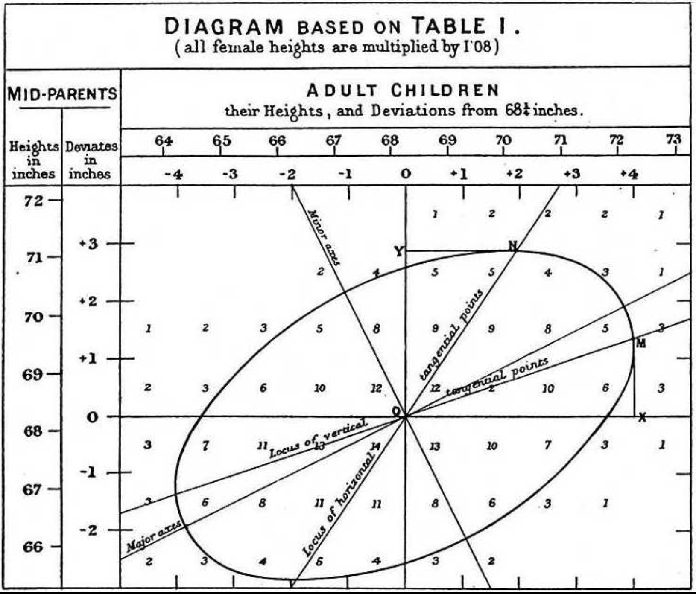

# Simple Linear Regression {#chap-simple-linear-regression}

This chapter will take the population parameter $\mu_{Y|X}(x)$, which was introduced in Chapter \@ref(sec-conditional-expectation), and operationalizes it by making a simplifying assumption of linearity and then approximating this linear function using sample-based statistics.

## The Simple Linear Regression (SLR) Model {#sec-slr-model}

For this Chapter we will assume that $X$ and $Y$ are both quantitative and that it is scientifically sensible to ascribe to $X$ the role of **input** and to $Y$ the role of **output**.  For example, the height of an adult child (Y) and the height of a parent (X).  It makes sense scientifically that the height of an adult child would be the result of the height of the parent and hence would be considered an output. 

With these special roles in mind, a population parameter that relates $X$ and $Y$ is the conditional expected value of $Y$ given $X = x$: $\mu_{Y|X}(x)$.  Note that this is explicitly a function of the values, $x$, of the random variable, $X$.  This could conceivably be a complicated function.  However, we can often make progress by positing a simple function instead.  The simpliest possible (non-trivial) function is the humble line:

$$
\mu_{Y|X}(x) = \beta_0 + \beta_1 x
$$

This simplification leads to the majority of the name: Simple Linear Regression (for the regression part, we will return to this below in Chapter \@ref(sec-slr-regression)).  This is of course a very strong assumption which needs to be checked (Chapter \@ref(sec-slr-assumptions)).

Note that $\beta_0$ (which is the **intercept**) and $\beta_1$ (which is the **slope**) are both still population parameters that need be approximated using sample-based statistics, which we will discover in Chapter \@ref(sec-slr-least-squares) below.  First, we will discuss some of the history behind SLR and in particular the origin of the phrase 'regression'.

### What Does the Word Regression Mean? {#sec-slr-regression}

The origins of the term 'regression' go back to 1800's with the research and discoveries of the prolific scientist Sir Francis Galton.  While some of his research has been discredited (namely eugenics), he discovered and subsequently coined major terms in heredity, evolution (along with he cousin Charles Darwin), and statistics such as 'nature vs. nurture', 'correlation', and 'standard deviation'.  As well, he is known for observing the central limit theorem (which he found very surprising), the bivariate normal distribution, and the first published weather forecast.  

Topically, he also described and explored a phenomenon he referred to as 'regression to the mean'.  He found that unusually smart or tall parents tended to have unusually smart or tall children, but not quite as smart or tall as the parents (he called this a `...regression toward mediocrity in hereditary stature'; the pessimistic phrasing is due to his hope that he would discover that humanity was on an upward trajectory towards superior intelligence and he was disappointed to find evidence to the contrary):

```{r, echo=FALSE, fig.cap = "Galton's correlation diagram relating Parent's height to Children's height.", fig.alt="Galton's correlation diagram relating Parent's height to Children's height", out.width='60%', fig.align='left'}

```

His observations of this phenomenon included carefully cultivating many generations of peas and measuring the average size of each pea.  It is this phrase that lends itself to the 'regression' part of SLR; that there is an overall mean to which observations naturally revert.

## The Least Squares Idea {#sec-slr-least-squares}

To operationalize SLR we need to find sample based statistics that approximate the population parameters $\beta_0$ and $\beta_1$.  Unlike our previous encounters with this idea, there isn't a natural sample-based analogue (for example, $\overline{X} \approx \mu_X$).  This is where another historical luminary, Carl Friedrich Gauss, made a major contribution.  His discovery, in which he was using many error-prone measurements of the orbit of the asteroid Ceres, was that various errors can be averaged away by minimizing the square of these deviations.  This minimizer became known as the **least squares solution**:

$$
\min_{b_0,b_1} \sum_{i=1}^n (y_i - (b_0 + b_1 x_i))^2
$$

There is a unique solution to this optimization problem (which you can derive yourself if you are sufficiently motivated via differential calculus) of the form:

:::: {.colbox data-latex=""}
::: {.proposition #slr-betaHats}

The solutions to the least squares idea is:

$$
\hat\beta_0 = \overline{y} - \hat\beta_1\overline{x}
$$

and 

$$
\hat\beta_1 =  \frac{\sum_{i=1}^n(x_i - \overline{x})(y_i - \overline{y})}{\sum_{i=1}^n(x_i - \overline{x})^2}
$$

We plug these values in to form the sample-based approximation to the parameter $\mu_{Y|X}(x)$:

$$
\hat{\mu}_{Y|X}(x) = \hat\beta_0 +  \hat\beta_1x
$$
Though computing these by hand is conceptual possible, a far better idea would be to use software via the `R` functions `lm` and `predict`
:::
::::

Let's get some idea about how to compute $\hat\beta_0$, $\hat\beta_1$, and $\hat{\mu}_{Y|X}(x)$ in practice:

:::: {.whitebox}
::: {.example #slr-betaHat-example}

A famous example of simple linear regression in history was the discovery of Hubble's Law: that a galaxies are moving away from Earth at a speed proportional to their distance to Earth.  This proportionality constant is often called the Hubble Constant.

To discover this value, a sample of galaxies are found and their distance (X) and their speed (Y) are recorded:

```{r}
x <- c(40.58, 95.32, 74.54, 61.87, 19.82, 19.82, 10.52, 87.29, 62.11, 72.27, 
          6.96, 97.14, 84.08, 25.17, 22.27, 22.42, 33.90, 54.85, 46.03, 32.67, 
          63.13, 18.25, 32.75, 39.80, 48.33, 79.59, 23.97, 53.85, 61.28, 9.41, 
          62.72, 21.20, 11.18, 95.14, 96.74)

y <- c(2600.59, 7051.23, 5334.17, 4076.86, 978.90, 1322.66, 522.80, 6107.86, 
         4255.63, 5214.42, -19.16, 7236.70, 6997.07, 2239.51, 1646.59, 1922.34, 
         1969.58, 3206.31, 3531.91, 2071.42, 3880.15, 925.40, 1840.54, 2840.08, 
         3615.71, 5926.52, 2035.56, 4071.66, 4206.69, 409.50, 3786.91, 1923.84, 
         711.50, 6495.94, 7243.34)
```

These observations look like this:

```{r, echo=FALSE,fig.cap = "Plot of distance (X) and speed (Y) that galaxies are from Earth", fig.alt="hubble plot.", out.width='70%'}
# 4. Plot the data and the regression line
plot(x, y,
     main = "Hubble's Law: Speed vs. Distance",
     xlab = "Distance (Mpc)",
     ylab = "Speed (km/s)",
     pch = 19, col = "royalblue")

# Add the regression line to the plot
abline(lm(y~x), col = "firebrick", lwd = 2)
```

The population parameter, $\beta_1$, describing the slope of this line is the Hubble constant.  We can approximate this value with $\hat\beta_1$:

```{r}
lm(y ~ x)
```

This value, `r lm(y ~ x)$coef[2]`, is then used as an input to cosmological models such as Einstein's equations of state, the geometry of the universe, and the origins of space and time as currently described by the Big Bang model.

Suppose we are additionally interested in the expected speed of the Sombrero galaxy, which is 10 Mpc away.  This is $\hat{\mu}_{Y|X}(10) = `r lm(y ~ x)$coef[1]` + `r lm(y ~ x)$coef[2]`*10 = `r predict(lm(y ~ x), data.frame(x=10))`$.  This means that we expect that a galaxy 10 Mpc away will be moving away from Earth at `r predict(lm(y ~ x), data.frame(x=10))` km/s.

We can compute this via the `R` function `predict` as well:

```{r}
lmEstimate = lm(y ~ x)
xValue     = data.frame(x = 10)
predict(lmEstimate, xValue)
```
:::
::::

Of course, $\hat\beta_1$ is just an approximation; we need to accompany with a measurement of its uncertainty relative to $\beta_1$.  We will do that via Confidence Intervals (Chapter \@ref(sec-slr-ci)) and Hypothesis Testing (Chapter \@ref(sec-slr-ht)) below.  For these results to be valid, the SLR model must meet a variety of assumptions that must be checked.


## Checking the Assumptions {#sec-slr-assumptions}

The relevant assumptions for linear regression are

 * **Linearity:** This is the key assumption: that $\mu_{Y|X}(x) = \beta_0 + \beta_1 x$; that is, it is a line.

 * **Independence:** The observations $(X_i,Y_i)$ are independent.  In words, this means the SLR model $\mu_{Y|X}(x)$ accounts for all of the *information* about our observations.

 * **Constant variance:** The *variance* of $Y$ doesn't depend on $X$.  Notationally, this is
 like writing $Var[Y|X] = \sigma^2(x) = \sigma^2$; that is, it doesn't depend on the values $X$ takes on.

 * **Normality:** This is an assumption about the conditional distribution of $Y$ given $X$.


For the **Normality** assumption, we typically rely on the central limit theorem and check if $n \geq 30$.  If not, then we need to check this assumption just like the others. 

Each of these assumptions can be checked by looking at the **residuals**:

$$
r_i = y_i - \mu_{Y|X}(x_i) = y_i - (\hat\beta_0 + \hat\beta_1 x_i)
$$

as a function of the **fitted values** $= \widehat{\mu}_{Y|X}(x_i)$. If the SLR assumptions are met, these **residual plots**, which puts the residuals on the vertical axis and the fitted values on the horizontal axis, should like `random noise'.  Let's look at some examples.

### Good Residuals

If there is no indications of assumption violations, the plot should look just like there is no discernible pattern.  Note that we should be looking for 'major' patterns; really obvious indications that the assumptions have been violated.  Here are a couple of examples of 'good' residuals:


```{r noViolation, echo=FALSE, fig.cap = "Example of Good Residuals: No indication of assumptions violations", fig.alt="A residual plot indicating no assumption violation.", out.width='70%',}
set.seed(3) # For reproducibility
x <- seq(3, 35, length.out = 100)
y <- 73 + 0.5 * x + rnorm(100, mean = 0, sd = 2) 

model <- lm(y ~ x)

# 3. Create the Residual Plot
# Extract residuals
residuals <- resid(model)
# Extract fitted values
fitted_values <- fitted(model)

# Plot Residuals vs Fitted
plot(fitted_values, residuals,
     #main = "Residuals vs Fitted",
     xlab = "Fitted Values",
     ylab = "Residuals",
     pch = 16, col = "black",
     cex=.75)

# Add a horizontal line at 0
abline(h = 0, col = "red", lwd = 2, lty = 2)
```

```{r noViolation2, echo=FALSE, fig.cap = "Another example of Good Residuals: No indication of assumptions violations", fig.alt="A residual plot indicating no assumption violation.", out.width='70%',}
set.seed(4) # For reproducibility
x <- seq(3, 35, length.out = 100)
# Quadratic relationship: y = x^2 + noise
y <- 73 + 0.5 * x + rnorm(100, mean = 0, sd = 2) 

# 2. Fit a Simple Linear Regression (incorrect model)
model <- lm(y ~ x)

# 3. Create the Residual Plot
# Extract residuals
residuals <- resid(model)
# Extract fitted values
fitted_values <- fitted(model)

# Plot Residuals vs Fitted
plot(fitted_values, residuals,
     #main = "Residuals vs Fitted",
     xlab = "Fitted Values",
     ylab = "Residuals",
     pch = 16, col = "black",
     cex=.75)

# Add a horizontal line at 0
abline(h = 0, col = "red", lwd = 2, lty = 2)
```


### Linearity

The most prominent of the assumptions is about the SLR model itself; that it is indeed sufficient to approximate $\mu_{Y|X}(x)$ with a line of the form $\beta_0 + \beta_1 x$.  This is a strong assumption and needs to be checked.  Here are some examples of residual plots where linearity is clearly violated:

```{r linearity, echo=FALSE, fig.cap = "Violating the linearity assumption: there appears to be a positive quadratic pattern", fig.alt="A residual plot indicating violating the linearity assumption.", out.width='70%',}
# 1. Generate Non-linear Data
set.seed(3) # For reproducibility
x <- seq(1, 100, length.out = 100)
# Quadratic relationship: y = x^2 + noise
y <- 0.5 * x^2 + rnorm(100, mean = 0, sd = 200) 

# 2. Fit a Simple Linear Regression (incorrect model)
model <- lm(y ~ x)

# 3. Create the Residual Plot
# Extract residuals
residuals <- resid(model)
# Extract fitted values
fitted_values <- fitted(model)

# Plot Residuals vs Fitted
plot(fitted_values, residuals,
     #main = "Residuals vs Fitted",
     xlab = "Fitted Values",
     ylab = "Residuals",
     pch = 16, col = "black",
     cex=.75)

# Add a horizontal line at 0
abline(h = 0, col = "red", lwd = 2, lty = 2)
```

```{r linearity2, echo=FALSE, fig.cap = "Violating the linearity assumption: there appears to be a negative quadratic pattern", fig.alt="A residual plot indicating violating the linearity assumption.", out.width='70%',}
set.seed(2) # For reproducibility
x <- seq(1, 100, length.out = 100)
# Quadratic relationship: y = x^2 + noise
y <- -0.5 * x^2 + rnorm(100, mean = 0, sd = 200) 

# 2. Fit a Simple Linear Regression (incorrect model)
model <- lm(y ~ x)

# 3. Create the Residual Plot
# Extract residuals
residuals <- resid(model)
# Extract fitted values
fitted_values <- fitted(model)

# Plot Residuals vs Fitted
plot(fitted_values, residuals,
     #main = "Residuals vs Fitted",
     xlab = "Fitted Values",
     ylab = "Residuals",
     pch = 16, col = "black",
     cex=.75)

# Add a horizontal line at 0
abline(h = 0, col = "red", lwd = 2, lty = 2)
```

```{r linearity3, echo=FALSE, fig.cap = "Violating the linearity assumption: there appears to be a cubic pattern", fig.alt="A residual plot indicating violating the linearity assumption.", out.width='70%',}
set.seed(4) # For reproducibility
x <- seq(-12, 12, length.out = 100)
# Quadratic relationship: y = x^2 + noise
y <- 0.5 * x^3 + rnorm(100, mean = 0, sd = 200) 

# 2. Fit a Simple Linear Regression (incorrect model)
model <- lm(y ~ x)

# 3. Create the Residual Plot
# Extract residuals
residuals <- resid(model)
# Extract fitted values
fitted_values <- fitted(model)

# Plot Residuals vs Fitted
plot(fitted_values, residuals,
     #main = "Residuals vs Fitted",
     xlab = "Fitted Values",
     ylab = "Residuals",
     pch = 16, col = "black",
     cex=.75)

# Add a horizontal line at 0
abline(h = 0, col = "red", lwd = 2, lty = 2)
```

### Constant Variance

This assumption feeds into confidence intervals and hypothesis tests for SLR.  The standard error term needs this assumption for it to be the correct value.  The hallmark pattern indicating this assumption has been violated is a 'funnel' shape, either increasing from left to right or from right to left:

```{r constantVar, echo=FALSE, fig.cap = "Indication of 'constant variance' assumption violation; the residuals are getting more variable from left to right", fig.alt="Constant variance assumption being violated", out.width='70%',}
# 1. Generate Non-linear Data
set.seed(3) # For reproducibility
x <- seq(1, 100, length.out = 100)
# Quadratic relationship: y = x^2 + noise
y <- 0.5 * x + rnorm(100, mean = 0, sd = 200*sqrt(x)) 

# 2. Fit a Simple Linear Regression (incorrect model)
model <- lm(y ~ x)

# 3. Create the Residual Plot
# Extract residuals
residuals <- resid(model)
# Extract fitted values
fitted_values <- fitted(model)

# Plot Residuals vs Fitted
plot(fitted_values, residuals,
     #main = "Residuals vs Fitted",
     xlab = "Fitted Values",
     ylab = "Residuals",
     pch = 16, col = "black",
     cex=.75)
abline(h = 0, col = "red", lwd = 2, lty = 2)
```

```{r constantVar2, echo=FALSE, fig.cap = "Indication of 'constant variance' assumption violation; the residuals are getting more variable from right to left", fig.alt="Constant variance assumption being violated", out.width='70%',}
# 1. Generate Non-linear Data
set.seed(3) # For reproducibility
x <- seq(1, 100, length.out = 100)
# Quadratic relationship: y = x^2 + noise
y <- 0.5 * x + rnorm(100, mean = 0, sd = 100/sqrt(x)) 

# 2. Fit a Simple Linear Regression (incorrect model)
model <- lm(y ~ x)

# 3. Create the Residual Plot
# Extract residuals
residuals <- resid(model)
# Extract fitted values
fitted_values <- fitted(model)

# Plot Residuals vs Fitted
plot(fitted_values, residuals,
     #main = "Residuals vs Fitted",
     xlab = "Fitted Values",
     ylab = "Residuals",
     pch = 16, col = "black",
     cex=.75)
abline(h = 0, col = "red", lwd = 2, lty = 2)
```

### Independence

Like the constant variance assumption above, in order for the formulae for the standard errors to be correct, and even for the central limit theorem to work, we need that the $(X_i, Y_i)$ are independent.  As always, this is an informational statement.  To assess this assumption we need to be on the lookout for *groups* or *bunches* or residuals that are all either unusually close together or above/below the zero line on the residual plot.

```{r independence1, echo=FALSE, fig.cap = "Indication of 'independence' assumption violation; there are bunches of residuals that are unnaturally close together", fig.alt="Independence assumption being violated", out.width='70%',}

# 1. Set seed for reproducibility
set.seed(3)

# 2. Simulate Independent Variable (X)
n <- 100
x <- seq(1, n)

# 3. Simulate Correlated Residuals (Violation of Independence)
# Instead of pure rnorm, we create an AR(1) process (rho = 0.8)
# resid[i] = rho * resid[i-1] + white_noise
true_errors <- numeric(n)
true_errors[1] <- rnorm(1)
rho <- 0.8 # Correlation parameter
for(i in 2:n) {
  true_errors[i] <- rho * true_errors[i-1] + rnorm(1, sd = 0.5)
}

# 4. Create Dependent Variable (Y) with a linear trend + correlated noise
y <- 10 + 2 * x + true_errors

# 5. Fit the Simple Linear Regression Model
model <- lm(y ~ x)

# 6. Generate Residuals vs Fitted Plot
plot(fitted(model), resid(model), 
     #main = "Residuals vs Fitted",
     xlab = "Fitted Values", 
     ylab = "Residuals", 
     pch = 16, col = "black",
     cex=.75)

abline(h = 0, col = "red", lwd = 2)
```

```{r independence2, echo=FALSE, fig.cap = "Indication of 'independence' assumption violation; there are bunches of residuals that are unnaturally close together", fig.alt="Independence assumption being violated", out.width='70%',}

# 1. Set seed for reproducibility
set.seed(4)

# 2. Simulate Independent Variable (X)
n <- 100
x <- seq(1, n)

# 3. Simulate Correlated Residuals (Violation of Independence)
# Instead of pure rnorm, we create an AR(1) process (rho = 0.8)
# resid[i] = rho * resid[i-1] + white_noise
true_errors <- numeric(n)
true_errors[1] <- rnorm(1)
rho <- 0.99 # Correlation parameter
for(i in 2:n) {
  true_errors[i] <- rho * true_errors[i-1] + rnorm(1, sd = 0.5)
}

# 4. Create Dependent Variable (Y) with a linear trend + correlated noise
y <- 10 + 2 * x + true_errors

# 5. Fit the Simple Linear Regression Model
model <- lm(y ~ x)

# 6. Generate Residuals vs Fitted Plot
plot(fitted(model), resid(model), 
     #main = "Residuals vs Fitted",
     xlab = "Fitted Values", 
     ylab = "Residuals", 
     pch = 16, col = "black",
     cex=.75)

abline(h = 0, col = "red", lwd = 2)
```

### Normality

To get the (approximate) $t_{n-2}$ distribution for $\widehat{\beta_1}$ and $\hat{\mu}_{Y|X}(x)$ we need to either:

* check that the residuals look sensibly normal by looking at the ... 
  * residual plot, mainly checking to see if there appears to be excessive skew or asymmetry
  * QQplot of the residuals to check to see if they have quantiles close to the normal quantiles
* verify that the sample size is large enough for the CLT (as usual, $n \geq 30$)

Let's look at a residual plot demonstrating a lack of normality (as well, the sample size is $n = 20 < 30$):

```{r normalResidPlot, echo=FALSE, fig.cap = "Indication of 'normality' assumption violation; there is excessive skew", fig.alt="Normality assumption being violated", out.width='70%',}
set.seed(10) # For reproducibility
x <- seq(155, 160, length.out = 20)
y <- (20 + rexp(length(x), rate = 1/(0.5 * x)) )**2

# 2. Fit a Simple Linear Regression (incorrect model)
model <- lm(y ~ x)

# 3. Create the Residual Plot
# Extract residuals
residuals <- resid(model)
# Extract fitted values
fitted_values <- fitted(model)

# Plot Residuals vs Fitted
plot(fitted_values, residuals,
     #main = "Residuals vs Fitted",
     xlab = "Fitted Values",
     ylab = "Residuals",
     pch = 16, col = "black",
     cex=.75)

# Add a horizontal line at 0
abline(h = 0, col = "red", lwd = 2, lty = 2)
```

A QQplot for these same residuals would also reveal a lack of normality as well:

```{r normalQQplot, echo=FALSE, fig.cap = "Indication of 'normality' assumption violation; QQPlot isn't close to a diagonal line, especially in the tails", fig.alt="Normality assumption being violated", out.width='70%',}
qqnorm(residuals, main = "Q-Q Plot of Residuals")
qqline(residuals, col = "blue", lwd = 2)
```


### Multiple Assumptions being Violated

It is common to see a combinations of assumptions violated.  For instance, here is an example of both constant variance and normality (however, the large sample size would mean the normality assumption is satisfied via the central limit theorem):

```{r normalityAndConstantVar, echo=FALSE}
# 1. Generate Non-linear Data
set.seed(3) # For reproducibility
x <- seq(10, 100, length.out = 100)
# Quadratic relationship: y = x^2 + noise
y <- 20 + rexp(100, rate = 1/(0.5 * x)) 

# 2. Fit a Simple Linear Regression (incorrect model)
model <- lm(y ~ x)

# 3. Create the Residual Plot
# Extract residuals
residuals <- resid(model)
# Extract fitted values
fitted_values <- fitted(model)

# Plot Residuals vs Fitted
plot(fitted_values, residuals,
     #main = "Residuals vs Fitted",
     xlab = "Fitted Values",
     ylab = "Residuals",
     pch = 16, col = "black",
     cex=.75)

# Add a horizontal line at 0
abline(h = 0, col = "red", lwd = 2, lty = 2)

# Add a LOESS smoother to highlight the pattern
#lines(smooth.spline(fitted_values, residuals), col = "darkgreen", lwd = 2)
```


## Covariance, Correlation, and R-squared  {#sec-slr-covariance-correlation}

Before we discuss confidence and prediction intervals as well as hypothesis testing there is a key concept for SLR that we need to introduce: R-squared ($R^2$).

Referring to the results in Section \@ref(sec-cov-and-corr), we can compare SLR to the other measures of association we have covered: covariance and correlation. Here, let's state the sample based statistics for the covariance:

$$
s_{X,Y} = \frac{1}{n-1} \sum_{i=1}^n(x_i - \overline{x})(y_i - \overline{y})= \frac{ \sum_{i=1}^n(x_i - \overline{x})(y_i - \overline{y})}{n-1}
$$

and the sample correlation:

$$
r_{X,Y} = \frac{s_{X,Y}}{s_X s_Y}
$$

Note that we have chosen $s_{X,Y}$ and $r_{X,Y}$ to go with $\sigma_{X,Y}$ (population covariance) and $\rho_{X,Y}$ (population correlation), respectively.  Combining these formulae with the definition of $\hat\beta_1$, we find that:


$$
\hat\beta_1 =  \frac{\sum_{i=1}^n(x_i - \overline{x})(y_i - \overline{y})}{\sum_{i=1}^n(x_i - \overline{x})^2}
= \frac{s_{X,Y}}{s_X^2} = r_{X,Y}*\left(\frac{s_Y}{s_X}\right) 
$$

In words, $\hat\beta_1$ differs from the sample correlation by a factor that is the ratio of the sample standard deviations of $Y$ and $X$, respectively.  This has several important implications about the relationship between $s_{X,Y}$, $r_{X,Y}$, and $\hat\beta_1$:

* All three statistics must equal 0 if any of them equal 0.

* All three statistics have the same sign (e.g. if one is positive they all must be positive)
 
* Both $s_{X,Y}$ and $r_{X,Y}$ are symmetric (in $X$ and $Y$) while  $\hat\beta_1$ is not

Hence, these statistics will agree on if there is a positive, negative, or if there is no relationship between $X$ and $Y$.  If there is a natural input/output relationship between $X$ and $Y$ then use SLR, if there isn't then you should use correlation.

### R-squared

Further strengthening the relationship between the sample correlation and $\hat\beta_1$ is the fundamental concept known as R-squared.  Recall that correlation must be between $[-1,1]$ and the close to $\pm 1$ it is, the stronger the relationship between $X$ and $Y$.  In the SLR context we can make an even better interpretation of correlation by forming $R^2 = r_{X,Y}^2$.  If we take $R^2$ and turn it into a percent, $100*R^2$%, then we call it R-squared and interpret it as 'the % of the variation in $Y$ that is explained by a linear function of $X$'.  


Let's return to the Hubble Constant example:

```{r, echo=FALSE}
x <- c(40.58, 95.32, 74.54, 61.87, 19.82, 19.82, 10.52, 87.29, 62.11, 72.27, 
          6.96, 97.14, 84.08, 25.17, 22.27, 22.42, 33.90, 54.85, 46.03, 32.67, 
          63.13, 18.25, 32.75, 39.80, 48.33, 79.59, 23.97, 53.85, 61.28, 9.41, 
          62.72, 21.20, 11.18, 95.14, 96.74)

y <- c(2600.59, 7051.23, 5334.17, 4076.86, 978.90, 1322.66, 522.80, 6107.86, 
         4255.63, 5214.42, -19.16, 7236.70, 6997.07, 2239.51, 1646.59, 1922.34, 
         1969.58, 3206.31, 3531.91, 2071.42, 3880.15, 925.40, 1840.54, 2840.08, 
         3615.71, 5926.52, 2035.56, 4071.66, 4206.69, 409.50, 3786.91, 1923.84, 
         711.50, 6495.94, 7243.34)
```

```{r}
cov(x,y)
cor(x,y)
lm(y~x)
```

Note that all of the statistics we mentioned are positive; we observe a positive relationship between distance and speed (Note that this was a shocking and fundamentally disruptive result in astronomy at the time. Hubble was nominated for a Nobel prize for this insight but died before he could be awarded).

We can convert between these in the aforementioned ways, for example:

```{r}
cor(x,y)*(sd(y)/sd(x))
```

To find R-squared, we can either square $r_{X,Y}$:
```{r}
cor(x,y)**2
```

or we can refer to the **Regression Table**:

```{r}
summary(lm(y~x))
```

and look at the line that starts `## Multiple R-squared:`.  In this case, we see that `r round( 100*cor(x,y)**2,2)`% of the variation in speed of a galaxy is explained by a linear function of its distance from Earth.  The remaining `r round(100*(1 - cor(x,y)**2),2)`% is presumably due to measurement error, galaxy specific idiosyncrasies, or, perhaps the next Nobel Prize!

Note that we will be referring to the **Regression Table** extensively in the next few sections.

## Confidence Intervals {#sec-slr-ci}

We need to accompany our approximations $\hat\beta_1$ and $\hat{\mu}_{Y|X}(x)$ with confidence intervals for the usual reason: $\hat\beta_1$ and $\hat{\mu}_{Y|X}(x)$ are random variables.

To do so, we need two ingredients:

* the standard errors
* the distribution of the standardized statistic

We will describe these results here:

:::: {.colbox data-latex=""}
::: {.proposition #slr-ci}

The standard error formulae for $\hat\beta_1$ and $\hat{\mu}_{Y|X}(x)$ are a bit cumbersome, so we will typically use software to compute them.  Nonetheless, here they are:

$$
S_{\hat\beta_1} = \sqrt{\frac{\hat{\sigma_e}^2}{\sum_{i=1}^n (X_i - \overline{X})^2}}
$$
and

$$
S_{\hat{\mu}_{Y|X}(x)} = \sqrt{\hat\sigma_r^2\left(\frac{1}{n} + \frac{(x-\overline{X})^2}{\sum_{i=1}^n (X_i - \overline{X})^2}\right)}
$$
In these expressions, $\hat{\sigma}_e^2$ is the often called the **mean squared error** and it estimates the variance formed by the 'constant variance' assumption outlined above:

$$
\hat{\sigma}_r^2 = \frac{1}{n-2}\sum_{i=1}^n (Y_i - \hat\mu_{Y|X}(X_i))^2
$$
In this expression, we see that $Y_i - \hat\mu_{Y|X}(X_i)$ is the residuals, so this is the sample variance of the residuals (hence, the notation $\hat\sigma_r^2$).

For the quantile for both confidence intervals is the same: $t_{n-2}$:

$$
\frac{ \hat{\beta}_1 - \beta_1}{S_{\hat{\beta}_1}} \sim t_{n-2}
$$
and 

$$
\frac{ \hat{\mu}_{Y|X}(x) - \mu_{Y|X}(x)}{S_{\hat{\mu}_{Y|X}(x)}} \sim t_{n-2}
$$
The resulting $(1-\alpha)100$% confidence intervals have the usual forms:
$$
\hat{\beta}_1 \pm t_{\alpha/2, n-2} S_{\hat{\beta}_1}
$$
and
$$
\hat{\mu}_{Y|X}(x)  \pm t_{\alpha/2, n-2} S_{\hat{\mu}_{Y|X}(x)}
$$
Though computing these by hand is conceptual possible, a far better idea would be to use software via the `R` functions `confint` and `predict`
:::
::::


The standard error of $\hat{\mu}_{Y|X}(x)$, $S_{\hat{\mu}_{Y|X}(x)}$, deserves further comment.  This is, as expected, a function of $x$.  Furthermore, the standard error gets larger as $x$ is farther from $\overline{X}$ due to the term $(x-\overline{X})^2$.  Hence, confidence intervals near $\overline{X}$ will be more precise (in the sense of being narrower).

Let's return to Example \@ref(exm:slr-betaHat-example):

:::: {.whitebox}
::: {.example #slr-ci-example}

An important aspect of this scientific question is to get a range of plausible values for population parameter, $\beta_1$, which describes the Hubble constant.  In classical cosmological models, this constant is $72 \pm 8$.  Let's use confidence intervals to find our own range of values. Let's form a `r (1-(alpha = .01))*100`% CI:

```{r, echo=FALSE}
x <- c(40.58, 95.32, 74.54, 61.87, 19.82, 19.82, 10.52, 87.29, 62.11, 72.27, 
          6.96, 97.14, 84.08, 25.17, 22.27, 22.42, 33.90, 54.85, 46.03, 32.67, 
          63.13, 18.25, 32.75, 39.80, 48.33, 79.59, 23.97, 53.85, 61.28, 9.41, 
          62.72, 21.20, 11.18, 95.14, 96.74)

y <- c(2600.59, 7051.23, 5334.17, 4076.86, 978.90, 1322.66, 522.80, 6107.86, 
         4255.63, 5214.42, -19.16, 7236.70, 6997.07, 2239.51, 1646.59, 1922.34, 
         1969.58, 3206.31, 3531.91, 2071.42, 3880.15, 925.40, 1840.54, 2840.08, 
         3615.71, 5926.52, 2035.56, 4071.66, 4206.69, 409.50, 3786.91, 1923.84, 
         711.50, 6495.94, 7243.34)
```

```{r}
confint(lm(y~x), level = 1-alpha)
```

This output provides confidence intervals for both $\beta_0$ (first row) and $\beta_1$ (second row).  A confidence interval for $\beta_0$ is rarely useful and should be ignored.

We have evidence that $\beta_1$ is between [`r confint(lm(y~x), level = 1-alpha)[2,1]`, `r confint(lm(y~x), level = 1-alpha)[2,2]`].  Comparing this to the previously mentioned range, and doing some rounding, we find $`r round(lm(y~x)$coef[2],0)` \pm `r round(confint(lm(y~x), level = 1-alpha)[2,2] - lm(y~x)$coef[2],0)`$

Note that the **Regression Table** provides all the necessary information for forming this confidence interval:

```{r}
summary(lm(y~x))
```

In particular, the `Estimate` and `Std. Error` parts for `x`.  This allows us to compute the confidence interval by hand if necessary: $`r lm(y~x)$coef[2]` \pm `r qt(1-alpha/2, lm(y~x)$df)`*`r summary(lm(y~x))$coef[2,2]`$, where $t_{`r alpha/2`, `r length(x)` - 2}$ = `r qt(1-alpha/2, lm(y~x)$df)`.

Suppose we are additionally interested in an interval for the **average** speed of a galaxy that is 10 Mpc away.  This is a confidence interval for $\mu_{Y|X}(10)$.  We found that $\hat{\mu}_{Y|X}(10) = `r predict(lm(y ~ x), data.frame(x=10))`$ km/s.  To form a `r (1-(alpha = .01))*100`% CI, we can use the  `R` function `predict` while using the additional `interval` argument

```{r}
lmEstimate = lm(y ~ x)
xValue     = data.frame(x = 10)
predict(lmEstimate, xValue, interval = 'confidence', level = 1-alpha)
```

Here is a plot with a confidence interval for $\mu_{Y|X}(x)$ on a grid of $x$ values:

```{r, echo=FALSE,fig.cap = "Plot of distance (X) and speed (Y) that galaxies are from Earth along with a confidence intervals", fig.alt="hubble plot with confidence interval.", out.width='70%'}
xValue  = data.frame(x = seq(min(x),max(x),length.out=1000))
cis     = predict(lmEstimate, xValue, interval = 'confidence', level = 1-alpha)

plot(x, y,
     main = "Hubble's Law: Speed vs. Distance",
     xlab = "Distance (Mpc)",
     ylab = "Speed (km/s)",
     pch = 19, col = "royalblue")

# Add the regression line to the plot
#abline(lm(y~x), col = "firebrick", lwd = 2)
lines(xValue$x, cis[,2], lwd=2)
lines(xValue$x, cis[,3], lwd=2)

legend(x='topleft',legend=c('Confidence'),lty=1,col='black')
```

Notice how these confidence intervals get narrower near the middle; this characteristic bowtie shape is due to the term $(x - \overline{X})^2$ in the standard error of $\hat{\mu}_{Y|X}(x)$.
:::
::::

In the above example, the confidence interval was for $\mu_{Y|X}(10)$.  This is not for a particular galaxy; rather for an average galaxy that is 10 Mpc away from Earth.  Referring to Example \@ref(exm:slr-betaHat-example), we are actually interested in the Sombrero galaxy specifically, not just an average galaxy.  To form an interval for a specific galaxy, $Y$, instead of an average galaxy, $\mu_{Y|X}(x)$, we need a **prediction interval**.

## Prediction Intervals  {#sec-slr-pi}

Following some of the ideas presented in Chapter \@ref(sec-ci-prediction), we can form a prediction interval for a **prediction**, which we will notate $\hat{Y}$.  Prediction intervals will be wider than confidence intervals.  This is due to incorporating not only the sampling distribution of $\hat{\mu}_{Y|X}(x)$ but also the individual variation in the random variable $Y$.


:::: {.colbox data-latex=""}
::: {.proposition #slr-pi}

The prediction interval has a standard error similar to the standard error of $\hat{mu}_{Y|X}(x)$, but with an additional term:

$$
S_{\hat{Y}|X = x} = \sqrt{\hat\sigma_r^2\left(1 + \frac{1}{n} + \frac{(x-\overline{X})^2}{\sum_{i=1}^n (X_i - \overline{X})^2}\right)}
$$
This additional term, which which is represented by a '1' in the above expression, accounts for the extra randomness included in trying to predict an individual value instead of the average value which is inherently more variable.

The resulting $(1-\alpha)100$% prediction interval for $Y$ is:
$$
\hat{\beta}_1 \pm t_{\alpha/2, n-2} S_{\hat{\beta}_1}
$$

We can use the already discussed `R` function `predict` by modifying the `interval` argument to be `interval = 'prediction'`.
:::
::::


Let's return to Example \@ref(exm:slr-betaHat-example) and finding a prediction interval for the speed of the Sombrero Galaxy in particular.

:::: {.whitebox}
::: {.example #slr-prediction-example}
Returning to the original question of interest, let's get a **prediction interval** for a specific galaxy, Sombrero, at 10 Mpc.  A `r (1-(alpha = .01))*100`% prediction interval would be:


```{r}
lmEstimate = lm(y ~ x)
xValue     = data.frame(x = 10)
predict(lmEstimate, xValue, interval = 'prediction', level = 1-alpha)
```

Suppose we are additionally interested in an interval for the **average** speed of a galaxy that is 10 Mpc away.  This is a confidence interval for $\mu_{Y|X}(10)$.  We found that $\hat{\mu}_{Y|X}(10) = `r predict(lm(y ~ x), data.frame(x=10))`$ km/s.  To form a `r (1-(alpha = .01))*100`% CI, we can use the  `R` function `predict` while using the additional `interval` argument
:::
::::

Here is a plot with both confidence intervals for $\mu_{Y|X}(x)$ and prediction intervals for $Y|X = x$ on a grid of $x$ values:

```{r, echo=FALSE,fig.cap = "Plot of distance (X) and speed (Y) that galaxies are from Earth along with a confidence and prediction intervals", fig.alt="hubble plot with confidence interval.", out.width='70%'}

xValue  = data.frame(x = seq(min(x),max(x),length.out=1000))
cis     = predict(lmEstimate, xValue, interval = 'confidence', level = 1-alpha)
pis     = predict(lmEstimate, xValue, interval = 'prediction', level = 1-alpha)

plot(x, y,
     main = "Hubble's Law: Speed vs. Distance",
     xlab = "Distance (Mpc)",
     ylab = "Speed (km/s)",
     pch = 19, col = "royalblue")

# Add the regression line to the plot
#abline(lm(y~x), col = "firebrick", lwd = 2)
lines(xValue$x, cis[,2], lwd=2)
lines(xValue$x, cis[,3], lwd=2)
lines(xValue$x, pis[,2], lwd=2,lty=2,col='red')
lines(xValue$x, pis[,3], lwd=2,lty=2,col='red')
legend(x='topleft',legend=c('Confidence', 'Prediction'),lty=1:2,col=c('black','red'))
```


Again, these prediction intervals get narrower near the middle and are much wider than confidence intervals.  This makes intuitive sense: if I needed to make a statement about average of a group of people vs. an individual person my statement could be much more precise about the average.

## Hypothesis Test {#sec-slr-ht}

We will be outlining a hypothesis test for the slope parameter $\beta_1$. Referring to the previous chapter about the relationship between SLR and correlation (Chapter \@ref(sec-slr-covariance-correlation)), a very common question is: do we have evidence that $\beta_1 \neq 0$?  If $\beta_1$ equals zero, then:

$$
\mu_{Y|X}(x) = \beta_0 + \beta_1 x = \beta_0
$$
and hence we are saying that the conditional expectation of $Y$ given $X$ doesn't depend on $X$ at all!  This doesn't imply that $X$ and $Y$ are independent, of course, but it makes a strong statement: the mean of $Y$ doesn't depend linearly on $X$.


:::: {.colbox data-latex=""}
::: {.proposition #slr-ht}

Suppose the above mentioned assumptions have been met.  The core hypothesis test for SLR is:

$$
H_0 : \beta_1 = b_1
\quad\text{vs.}\quad
H_A : \beta_1 \neq b_1
$$

where the vast majority of the time, as well as the software defaults, sets $b_0 = 0$.  We form the test statistic:

$$
T = \frac{\hat\beta_1 - b_1}{S_{\hat\beta_1}} \sim t_{n-2}
$$
(Assuming the null hypothesis is true: that $\beta_1$ indeed equals the constant $b_1$).  For the standard error, $S_{\hat\beta_1}$, see Proposition \@ref(prp:slr-ci) for details.

Hence, for any significance level $\alpha$, we would reject if we get an observed test statistic that exceeds (in absolute value) the critical value $t_{\alpha/2,n-2}$:

$$
|T_{obs}| > t_{\alpha/2,n-2}
$$
Equivalently, this is more often evaluated by rejecting if the p-value $< \alpha$.

This is almost always evaluated using the **Regression Table** produced via the `R` command `summary(lm(y~x))`
:::
::::

Let's return one more time to our running example started in Example \@ref(exm:slr-betaHat-example).

:::: {.whitebox}
::: {.example #slr-betaHat-example}

Although it is considered a central idea in modern cosmology, in 1929 the idea that the universe was expanding was deeply controversal. To help test this idea, we can use hypothesis testing for the slope coefficient $\beta_1$.  If we have evidence that it is non-zero, then the expanding universe claim becomes more credible.

```{r, echo=FALSE}
x <- c(40.58, 95.32, 74.54, 61.87, 19.82, 19.82, 10.52, 87.29, 62.11, 72.27, 
          6.96, 97.14, 84.08, 25.17, 22.27, 22.42, 33.90, 54.85, 46.03, 32.67, 
          63.13, 18.25, 32.75, 39.80, 48.33, 79.59, 23.97, 53.85, 61.28, 9.41, 
          62.72, 21.20, 11.18, 95.14, 96.74)

y <- c(2600.59, 7051.23, 5334.17, 4076.86, 978.90, 1322.66, 522.80, 6107.86, 
         4255.63, 5214.42, -19.16, 7236.70, 6997.07, 2239.51, 1646.59, 1922.34, 
         1969.58, 3206.31, 3531.91, 2071.42, 3880.15, 925.40, 1840.54, 2840.08, 
         3615.71, 5926.52, 2035.56, 4071.66, 4206.69, 409.50, 3786.91, 1923.84, 
         711.50, 6495.94, 7243.34)
alpha = .01
```

We will again use $\alpha = 0.01$ to evaluate this claim.  Let's return to the **Regression Table**

```{r}
summary(lm(y~x))
```

Our observed test statistic is enormous: $T_{obs} = `r round(summary(lm(y~x))$coefficients[2,3],3)`$.  The associated p-value is infinitesimal. Hence, we have strong evidence that $\beta_1$ does not equal zero and that the universe isn't static; rather it is changing.

(In fact, based on a series of observations in 1998 of more distant supernovae, we found that not only is the universe expanding but at an *increasing* rate! This time, unlike in Hubble's case earlier in the century, this discovery won a well deserved Nobel prize in 2011).
:::
::::